# 分布式ID生成器系统详细时序图（奇偶区间错开模式）

## 概述

本文档提供了基于奇偶区间错开模式的分布式ID生成器系统的详细时序图，包含ASCII和Mermaid两个版本，涵盖了系统的核心流程：
1. 正常ID生成流程（区间模式）
2. 区间跳跃刷新流程  
3. 服务器注册与心跳流程
4. 容错切换流程（全区间代理）
5. 批量ID生成流程
6. 系统启动初始化流程
7. 步长变更与区间重分配流程

### 奇偶区间错开模式特点
- **奇数服务器**：使用区间 [1,1000], [2001,3000], [4001,5000], ...
- **偶数服务器**：使用区间 [1001,2000], [3001,4000], [5001,6000], ...
- **零ID浪费**：每个区间内的ID完全使用，无跳跃浪费
- **完全隔离**：奇偶服务器的ID空间完全分离

---

## 1. 奇偶区间错开ID生成流程

### 1.1 ASCII版本

```
客户端        负载均衡器      业务服务器        内存缓存        奇偶区间服务器      数据库
  |              |              |              |              |              |
  |--请求ID------>|              |              |              |              |
  |              |--路由请求---->|              |              |              |
  |              |              |--检查区间---->|              |              |
  |              |              |              |--区间可用---->|              |
  |              |              |<--返回区间ID--|              |              |
  |              |              |              |              |              |
  |              |              |--原子递增---->|              |              |
  |              |              |<--返回新ID----|              |              |
  |              |              |              |              |              |
  |              |              |--检查阈值---->|              |              |
  |              |              |              |--需要刷新---->|              |
  |              |              |              |              |              |
  |              |              |--异步预取---->|              |              |
  |              |              |              |--跳跃区间---->|              |
  |              |              |              |              |--计算下个区间->|
  |              |              |              |              |<--返回新区间--|
  |              |              |              |<--更新区间----|              |
  |              |              |              |              |              |
  |              |<--返回ID------|              |              |              |
  |<--响应ID-----|              |              |              |              |
  |              |              |              |              |              |
```

### 1.2 Mermaid版本

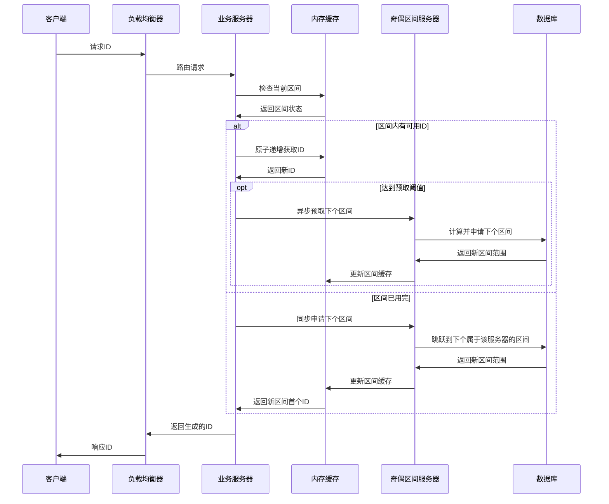
```mermaid
sequenceDiagram
    participant C as 客户端
    participant LB as 负载均衡器
    participant BS as 业务服务器
    participant Cache as 内存缓存
    participant IS as 奇偶区间服务器
    participant DB as 数据库

    C->>LB: 请求ID
    LB->>BS: 路由请求
    BS->>Cache: 检查当前区间
    Cache->>BS: 返回区间状态
    
    alt 区间内有可用ID
        BS->>Cache: 原子递增获取ID
        Cache->>BS: 返回新ID
        
        opt 达到预取阈值
            BS->>IS: 异步预取下个区间
            IS->>DB: 计算并申请下个区间
            DB->>IS: 返回新区间范围
            IS->>Cache: 更新区间缓存
        end
        
    else 区间已用完
        BS->>IS: 同步申请下个区间
        IS->>DB: 跳跃到下个属于该服务器的区间
        DB->>IS: 返回新区间范围
        IS->>Cache: 更新区间缓存
        Cache->>BS: 返回新区间首个ID
    end
    
    BS->>LB: 返回生成的ID
    LB->>C: 响应ID
```

---

## 2. 正常ID生成流程（原版本）

### 1.1 ASCII版本

```
客户端        负载均衡器      业务服务器        内存缓存        奇偶分片服务器      数据库
  |              |              |              |              |              |
  |--请求ID----->|              |              |              |              |
  |              |--路由请求---->|              |              |              |
  |              |              |--检查缓存---->|              |              |
  |              |              |              |--缓存命中---->|              |
  |              |              |<--返回可用ID--|              |              |
  |              |              |              |              |              |
  |              |              |--原子递增---->|              |              |
  |              |              |<--返回新ID----|              |              |
  |              |              |              |              |              |
  |              |              |--检查阈值---->|              |              |
  |              |              |              |--需要刷新---->|              |
  |              |              |              |              |              |
  |              |              |--异步刷新---->|              |              |
  |              |              |              |--预取号段---->|              |
  |              |              |              |              |--获取新号段-->|
  |              |              |              |              |<--返回号段----|
  |              |              |              |<--更新缓存----|              |
  |              |              |              |              |              |
  |              |<--返回ID------|              |              |              |
  |<--响应ID-----|              |              |              |              |
  |              |              |              |              |              |
```

### 1.2 Mermaid版本

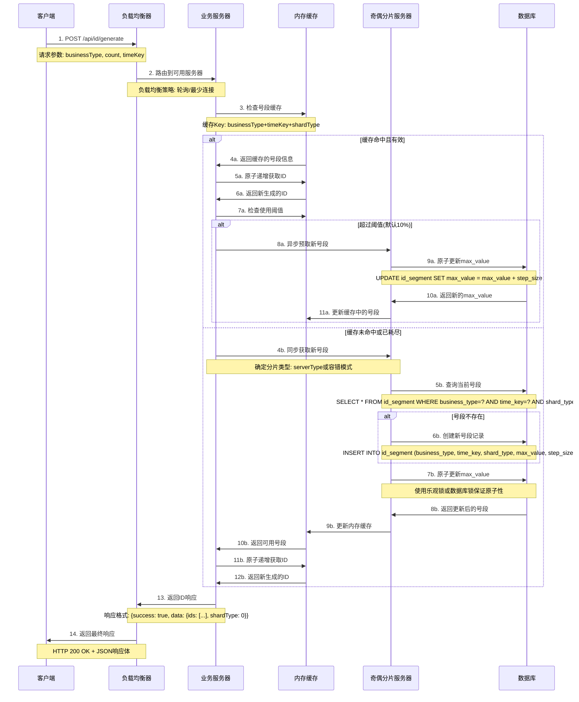
```mermaid
sequenceDiagram
    participant C as 客户端
    participant LB as 负载均衡器
    participant BS as 业务服务器
    participant Cache as 内存缓存
    participant SS as 奇偶分片服务器
    participant DB as 数据库

    C->>LB: 1. POST /api/id/generate
    Note over C,LB: 请求参数: businessType, count, timeKey
    
    LB->>BS: 2. 路由到可用服务器
    Note over LB,BS: 负载均衡策略: 轮询/最少连接
    
    BS->>Cache: 3. 检查号段缓存
    Note over BS,Cache: 缓存Key: businessType+timeKey+shardType
    
    alt 缓存命中且有效
        Cache->>BS: 4a. 返回缓存的号段信息
        BS->>Cache: 5a. 原子递增获取ID
        Cache->>BS: 6a. 返回新生成的ID
        
        BS->>Cache: 7a. 检查使用阈值
        alt 超过阈值(默认10%)
            BS->>SS: 8a. 异步预取新号段
            SS->>DB: 9a. 原子更新max_value
            Note over SS,DB: UPDATE id_segment SET max_value = max_value + step_size
            DB->>SS: 10a. 返回新的max_value
            SS->>Cache: 11a. 更新缓存中的号段
        end
        
    else 缓存未命中或已耗尽
        BS->>SS: 4b. 同步获取新号段
        Note over BS,SS: 确定分片类型: serverType或容错模式
        
        SS->>DB: 5b. 查询当前号段
        Note over SS,DB: SELECT * FROM id_segment WHERE business_type=? AND time_key=? AND shard_type=?
        
        alt 号段不存在
            SS->>DB: 6b. 创建新号段记录
            Note over SS,DB: INSERT INTO id_segment (business_type, time_key, shard_type, max_value, step_size)
        end
        
        SS->>DB: 7b. 原子更新max_value
        Note over SS,DB: 使用乐观锁或数据库锁保证原子性
        DB->>SS: 8b. 返回更新后的号段
        
        SS->>Cache: 9b. 更新内存缓存
        Cache->>BS: 10b. 返回可用号段
        
        BS->>Cache: 11b. 原子递增获取ID
        Cache->>BS: 12b. 返回新生成的ID
    end
    
    BS->>LB: 13. 返回ID响应
    Note over BS,LB: 响应格式: {success: true, data: {ids: [...], shardType: 0}}
    
    LB->>C: 14. 返回最终响应
    Note over LB,C: HTTP 200 OK + JSON响应体
```

---

## 2. 号段刷新流程

### 2.1 ASCII版本

```
业务服务器      内存缓存      分片服务器        数据库          锁管理器
    |              |              |              |              |
    |--检查阈值---->|              |              |              |
    |              |--使用率90%---->|              |              |
    |              |              |              |              |
    |--获取刷新锁-->|              |              |              |
    |              |              |              |              |--尝试加锁-->|
    |              |              |              |              |<--锁获取成功-|
    |              |              |              |              |
    |--开始刷新---->|              |              |              |
    |              |--查询当前号段->|              |              |
    |              |              |--SELECT查询-->|              |
    |              |              |<--返回当前值--|              |
    |              |              |              |              |
    |              |              |--原子更新---->|              |
    |              |              |              |--BEGIN TRAN->|
    |              |              |              |--UPDATE---->|
    |              |              |              |--COMMIT---->|
    |              |              |<--新max_value-|              |
    |              |              |              |              |
    |              |<--更新缓存----|              |              |
    |              |              |              |              |
    |--释放锁------>|              |              |              |
    |              |              |              |              |--释放锁---->|
    |<--刷新完成----|              |              |              |
    |              |              |              |              |
```

### 2.2 Mermaid版本

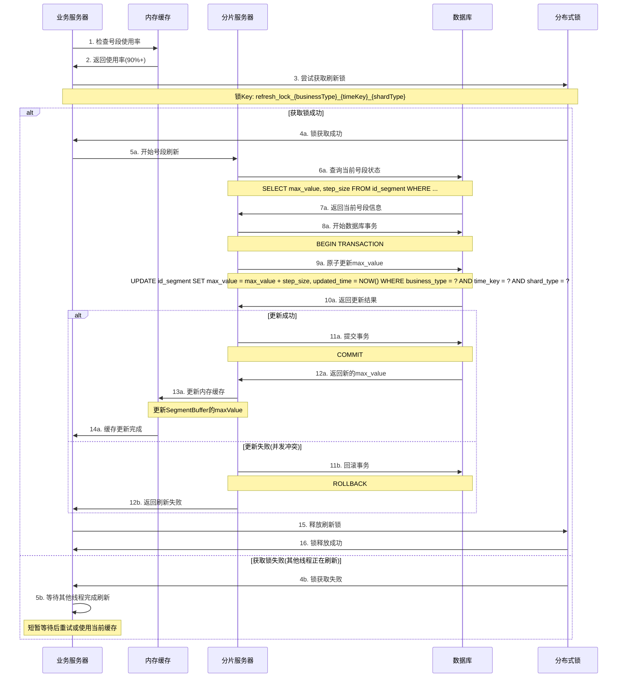
```mermaid
sequenceDiagram
    participant BS as 业务服务器
    participant Cache as 内存缓存
    participant SS as 分片服务器
    participant DB as 数据库
    participant Lock as 分布式锁

    BS->>Cache: 1. 检查号段使用率
    Cache->>BS: 2. 返回使用率(90%+)
    
    BS->>Lock: 3. 尝试获取刷新锁
    Note over BS,Lock: 锁Key: refresh_lock_{businessType}_{timeKey}_{shardType}
    
    alt 获取锁成功
        Lock->>BS: 4a. 锁获取成功
        
        BS->>SS: 5a. 开始号段刷新
        SS->>DB: 6a. 查询当前号段状态
        Note over SS,DB: SELECT max_value, step_size FROM id_segment WHERE ...
        
        DB->>SS: 7a. 返回当前号段信息
        
        SS->>DB: 8a. 开始数据库事务
        Note over SS,DB: BEGIN TRANSACTION
        
        SS->>DB: 9a. 原子更新max_value
        Note over SS,DB: UPDATE id_segment SET max_value = max_value + step_size, updated_time = NOW() WHERE business_type = ? AND time_key = ? AND shard_type = ?
        
        DB->>SS: 10a. 返回更新结果
        
        alt 更新成功
            SS->>DB: 11a. 提交事务
            Note over SS,DB: COMMIT
            
            DB->>SS: 12a. 返回新的max_value
            SS->>Cache: 13a. 更新内存缓存
            Note over SS,Cache: 更新SegmentBuffer的maxValue
            
            Cache->>BS: 14a. 缓存更新完成
            
        else 更新失败(并发冲突)
            SS->>DB: 11b. 回滚事务
            Note over SS,DB: ROLLBACK
            
            SS->>BS: 12b. 返回刷新失败
        end
        
        BS->>Lock: 15. 释放刷新锁
        Lock->>BS: 16. 锁释放成功
        
    else 获取锁失败(其他线程正在刷新)
        Lock->>BS: 4b. 锁获取失败
        BS->>BS: 5b. 等待其他线程完成刷新
        Note over BS: 短暂等待后重试或使用当前缓存
    end
```

---

## 3. 服务器注册与心跳流程

### 3.1 ASCII版本

```
应用启动        服务注册器      数据库          心跳调度器      监控系统
    |              |              |              |              |
    |--@PostConstruct->|              |              |              |
    |              |--生成ServerID->|              |              |
    |              |              |              |              |
    |              |--检查注册表---->|              |              |
    |              |              |--SELECT查询-->|              |
    |              |              |<--返回结果----|              |
    |              |              |              |              |
    |              |--注册/更新---->|              |              |
    |              |              |--INSERT/UPDATE->|              |
    |              |              |<--注册成功----|              |
    |              |              |              |              |
    |              |--启动心跳---->|              |              |
    |              |              |              |--定时任务---->|
    |              |              |              |              |
    |              |              |              |--更新心跳---->|
    |              |              |              |              |--UPDATE--->|
    |              |              |              |              |<--更新成功--|
    |              |              |              |              |
    |              |              |              |--检查状态---->|
    |              |              |              |              |--SELECT--->|
    |              |              |              |              |<--服务列表--|
    |              |              |              |<--状态报告----|
    |              |              |              |              |
```

### 3.2 Mermaid版本

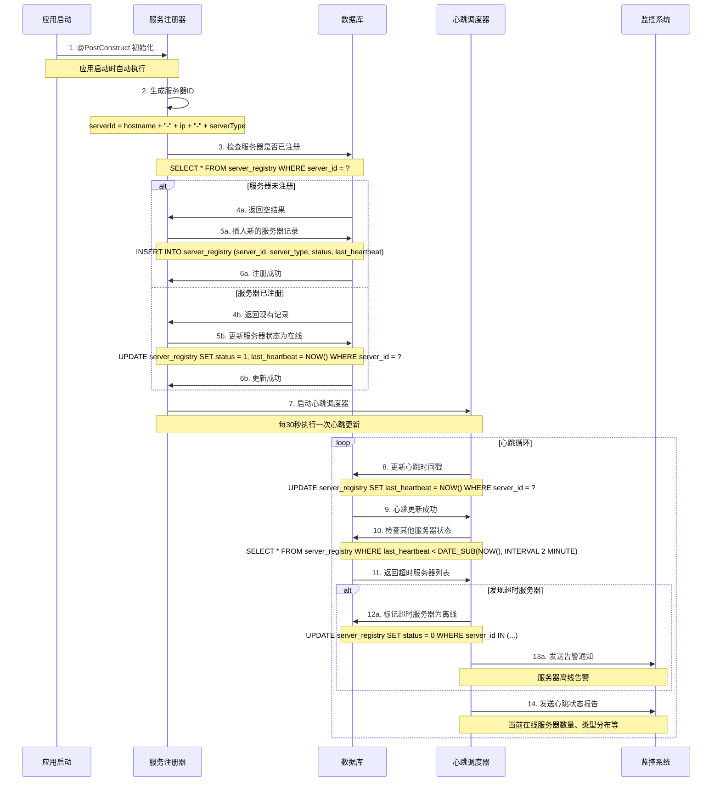
```mermaid
sequenceDiagram
    participant App as 应用启动
    participant SR as 服务注册器
    participant DB as 数据库
    participant HB as 心跳调度器
    participant Monitor as 监控系统

    App->>SR: 1. @PostConstruct 初始化
    Note over App,SR: 应用启动时自动执行
    
    SR->>SR: 2. 生成服务器ID
    Note over SR: serverId = hostname + "-" + ip + "-" + serverType
    
    SR->>DB: 3. 检查服务器是否已注册
    Note over SR,DB: SELECT * FROM server_registry WHERE server_id = ?
    
    alt 服务器未注册
        DB->>SR: 4a. 返回空结果
        SR->>DB: 5a. 插入新的服务器记录
        Note over SR,DB: INSERT INTO server_registry (server_id, server_type, status, last_heartbeat)
        DB->>SR: 6a. 注册成功
        
    else 服务器已注册
        DB->>SR: 4b. 返回现有记录
        SR->>DB: 5b. 更新服务器状态为在线
        Note over SR,DB: UPDATE server_registry SET status = 1, last_heartbeat = NOW() WHERE server_id = ?
        DB->>SR: 6b. 更新成功
    end
    
    SR->>HB: 7. 启动心跳调度器
    Note over SR,HB: 每30秒执行一次心跳更新
    
    loop 心跳循环
        HB->>DB: 8. 更新心跳时间戳
        Note over HB,DB: UPDATE server_registry SET last_heartbeat = NOW() WHERE server_id = ?
        
        DB->>HB: 9. 心跳更新成功
        
        HB->>DB: 10. 检查其他服务器状态
        Note over HB,DB: SELECT * FROM server_registry WHERE last_heartbeat < DATE_SUB(NOW(), INTERVAL 2 MINUTE)
        
        DB->>HB: 11. 返回超时服务器列表
        
        alt 发现超时服务器
            HB->>DB: 12a. 标记超时服务器为离线
            Note over HB,DB: UPDATE server_registry SET status = 0 WHERE server_id IN (...)
            
            HB->>Monitor: 13a. 发送告警通知
            Note over HB,Monitor: 服务器离线告警
        end
        
        HB->>Monitor: 14. 发送心跳状态报告
        Note over HB,Monitor: 当前在线服务器数量、类型分布等
    end
```

---

## 4. 容错切换流程

### 4.1 ASCII版本

```
偶数服务器      奇数服务器      数据库          监控系统        客户端
    |              |              |              |              |
    |--正常工作---->|              |              |              |
    |              |--正常工作---->|              |              |
    |              |              |              |              |
    |              |--心跳超时---->|              |              |
    |              |              |--标记离线---->|              |
    |              |              |              |--告警通知---->|
    |              |              |              |              |
    |--检测对方状态->|              |              |              |
    |              |              |--查询状态---->|              |
    |              |              |<--对方离线----|              |
    |              |              |              |              |
    |--启动容错模式->|              |              |              |
    |              |              |              |              |
    |--处理奇数请求->|              |              |              |
    |              |              |--获取奇数号段->|              |
    |              |              |<--返回号段----|              |
    |              |              |              |              |
    |              |              |              |              |--请求ID----->|
    |<--奇偶兼容----|              |              |              |
    |              |              |              |              |<--返回ID-----|
    |              |              |              |              |
    |              |--服务恢复---->|              |              |
    |              |              |--更新状态---->|              |
    |              |              |              |--恢复通知---->|
    |              |              |              |              |
    |--恢复正常模式->|              |              |              |
    |              |--负载重平衡-->|              |              |
    |              |              |              |              |
```

### 4.2 Mermaid版本

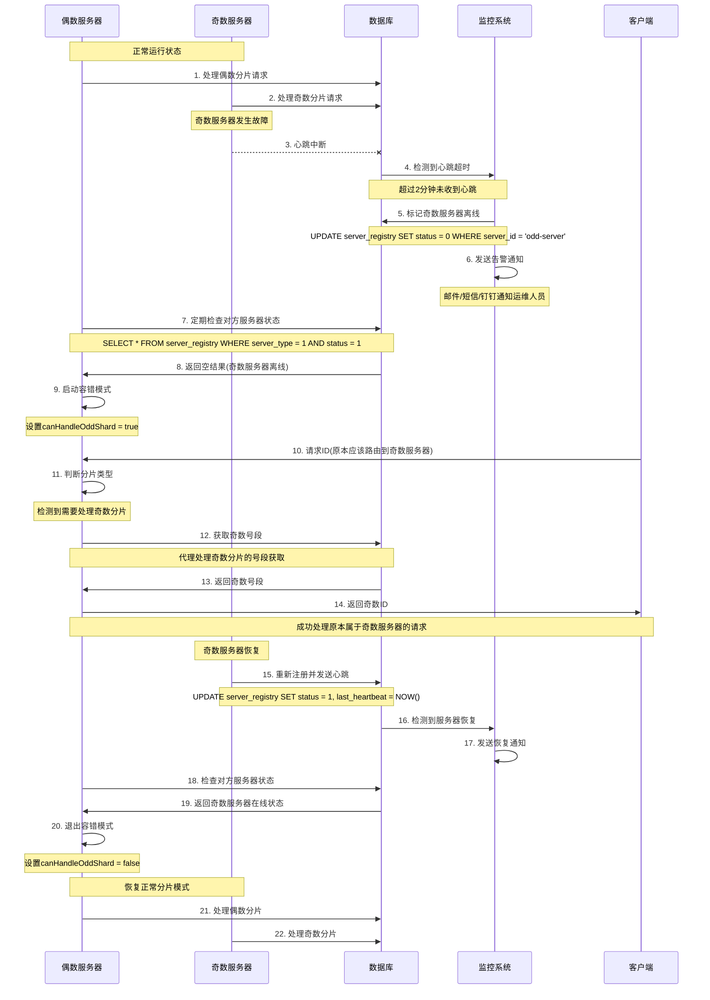
```mermaid
sequenceDiagram
    participant ES as 偶数服务器
    participant OS as 奇数服务器  
    participant DB as 数据库
    participant Monitor as 监控系统
    participant Client as 客户端

    Note over ES,OS: 正常运行状态
    ES->>DB: 1. 处理偶数分片请求
    OS->>DB: 2. 处理奇数分片请求
    
    Note over OS: 奇数服务器发生故障
    OS--xDB: 3. 心跳中断
    
    DB->>Monitor: 4. 检测到心跳超时
    Note over DB,Monitor: 超过2分钟未收到心跳
    
    Monitor->>DB: 5. 标记奇数服务器离线
    Note over Monitor,DB: UPDATE server_registry SET status = 0 WHERE server_id = 'odd-server'
    
    Monitor->>Monitor: 6. 发送告警通知
    Note over Monitor: 邮件/短信/钉钉通知运维人员
    
    ES->>DB: 7. 定期检查对方服务器状态
    Note over ES,DB: SELECT * FROM server_registry WHERE server_type = 1 AND status = 1
    
    DB->>ES: 8. 返回空结果(奇数服务器离线)
    
    ES->>ES: 9. 启动容错模式
    Note over ES: 设置canHandleOddShard = true
    
    Client->>ES: 10. 请求ID(原本应该路由到奇数服务器)
    
    ES->>ES: 11. 判断分片类型
    Note over ES: 检测到需要处理奇数分片
    
    ES->>DB: 12. 获取奇数号段
    Note over ES,DB: 代理处理奇数分片的号段获取
    
    DB->>ES: 13. 返回奇数号段
    
    ES->>Client: 14. 返回奇数ID
    Note over ES,Client: 成功处理原本属于奇数服务器的请求
    
    Note over OS: 奇数服务器恢复
    OS->>DB: 15. 重新注册并发送心跳
    Note over OS,DB: UPDATE server_registry SET status = 1, last_heartbeat = NOW()
    
    DB->>Monitor: 16. 检测到服务器恢复
    Monitor->>Monitor: 17. 发送恢复通知
    
    ES->>DB: 18. 检查对方服务器状态
    DB->>ES: 19. 返回奇数服务器在线状态
    
    ES->>ES: 20. 退出容错模式
    Note over ES: 设置canHandleOddShard = false
    
    Note over ES,OS: 恢复正常分片模式
    ES->>DB: 21. 处理偶数分片
    OS->>DB: 22. 处理奇数分片
```

---

## 5. 批量ID生成流程

### 5.1 ASCII版本

```
客户端        业务服务器      内存缓存        分片服务器      数据库
  |              |              |              |              |
  |--批量请求---->|              |              |              |
  |  count=1000   |              |              |              |
  |              |--检查缓存容量->|              |              |
  |              |              |--容量不足---->|              |
  |              |              |              |              |
  |              |--计算所需号段->|              |              |
  |              |              |              |              |
  |              |--批量获取号段->|              |              |
  |              |              |--请求多个号段->|              |
  |              |              |              |--批量更新---->|
  |              |              |              |<--返回号段----|
  |              |              |<--更新缓存----|              |
  |              |              |              |              |
  |              |--批量生成ID-->|              |              |
  |              |              |--原子递增1000次->|              |
  |              |              |<--返回ID列表--|              |
  |              |              |              |              |
  |              |--计算路由信息->|              |              |
  |              |              |              |              |
  |<--返回结果----|              |              |              |
  |  ids=[...]    |              |              |              |
  |  routing={}   |              |              |              |
  |              |              |              |              |
```

### 5.2 Mermaid版本

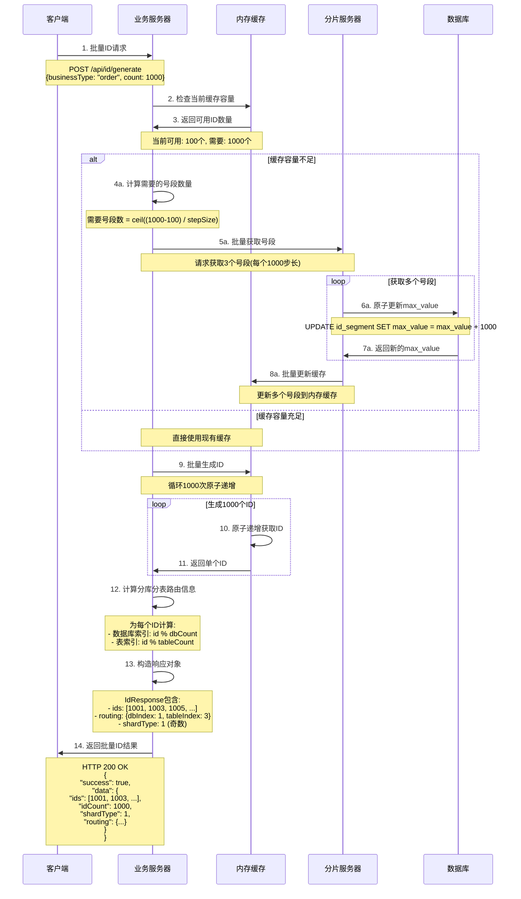
```mermaid
sequenceDiagram
    participant C as 客户端
    participant BS as 业务服务器
    participant Cache as 内存缓存
    participant SS as 分片服务器
    participant DB as 数据库

    C->>BS: 1. 批量ID请求
    Note over C,BS: POST /api/id/generate<br/>{businessType: "order", count: 1000}
    
    BS->>Cache: 2. 检查当前缓存容量
    Cache->>BS: 3. 返回可用ID数量
    Note over Cache,BS: 当前可用: 100个, 需要: 1000个
    
    alt 缓存容量不足
        BS->>BS: 4a. 计算需要的号段数量
        Note over BS: 需要号段数 = ceil((1000-100) / stepSize)
        
        BS->>SS: 5a. 批量获取号段
        Note over BS,SS: 请求获取3个号段(每个1000步长)
        
        loop 获取多个号段
            SS->>DB: 6a. 原子更新max_value
            Note over SS,DB: UPDATE id_segment SET max_value = max_value + 1000
            DB->>SS: 7a. 返回新的max_value
        end
        
        SS->>Cache: 8a. 批量更新缓存
        Note over SS,Cache: 更新多个号段到内存缓存
        
    else 缓存容量充足
        Note over BS,Cache: 直接使用现有缓存
    end
    
    BS->>Cache: 9. 批量生成ID
    Note over BS,Cache: 循环1000次原子递增
    
    loop 生成1000个ID
        Cache->>Cache: 10. 原子递增获取ID
        Cache->>BS: 11. 返回单个ID
    end
    
    BS->>BS: 12. 计算分库分表路由信息
    Note over BS: 为每个ID计算:<br/>- 数据库索引: id % dbCount<br/>- 表索引: id % tableCount
    
    BS->>BS: 13. 构造响应对象
    Note over BS: IdResponse包含:<br/>- ids: [1001, 1003, 1005, ...]<br/>- routing: {dbIndex: 1, tableIndex: 3}<br/>- shardType: 1 (奇数)
    
    BS->>C: 14. 返回批量ID结果
    Note over BS,C: HTTP 200 OK<br/>{<br/>  "success": true,<br/>  "data": {<br/>    "ids": [1001, 1003, ...],<br/>    "idCount": 1000,<br/>    "shardType": 1,<br/>    "routing": {...}<br/>  }<br/>}
```

---

## 6. 系统启动初始化流程

### 6.1 ASCII版本

```
SpringBoot      配置加载器      数据库连接      服务注册        缓存初始化      健康检查
    |              |              |              |              |              |
    |--启动应用---->|              |              |              |              |
    |              |--加载配置---->|              |              |              |
    |              |              |              |              |              |
    |              |--数据库配置-->|              |              |              |
    |              |              |--连接测试---->|              |              |
    |              |              |<--连接成功----|              |              |
    |              |              |              |              |              |
    |              |--初始化表结构->|              |              |              |
    |              |              |--CREATE TABLE->|              |              |
    |              |              |<--表创建成功--|              |              |
    |              |              |              |              |              |
    |              |--服务注册---->|              |              |              |
    |              |              |              |--注册服务器-->|              |
    |              |              |              |<--注册成功----|              |
    |              |              |              |              |              |
    |              |--初始化缓存-->|              |              |              |
    |              |              |              |              |--创建缓存Map->|
    |              |              |              |              |<--缓存就绪----|
    |              |              |              |              |              |
    |              |--启动定时任务->|              |              |              |
    |              |              |              |              |              |--心跳任务-->|
    |              |              |              |              |              |--健康检查-->|
    |              |              |              |              |              |<--任务启动--|
    |              |              |              |              |              |
    |<--启动完成----|              |              |              |              |
    |              |              |              |              |              |
```

### 6.2 Mermaid版本

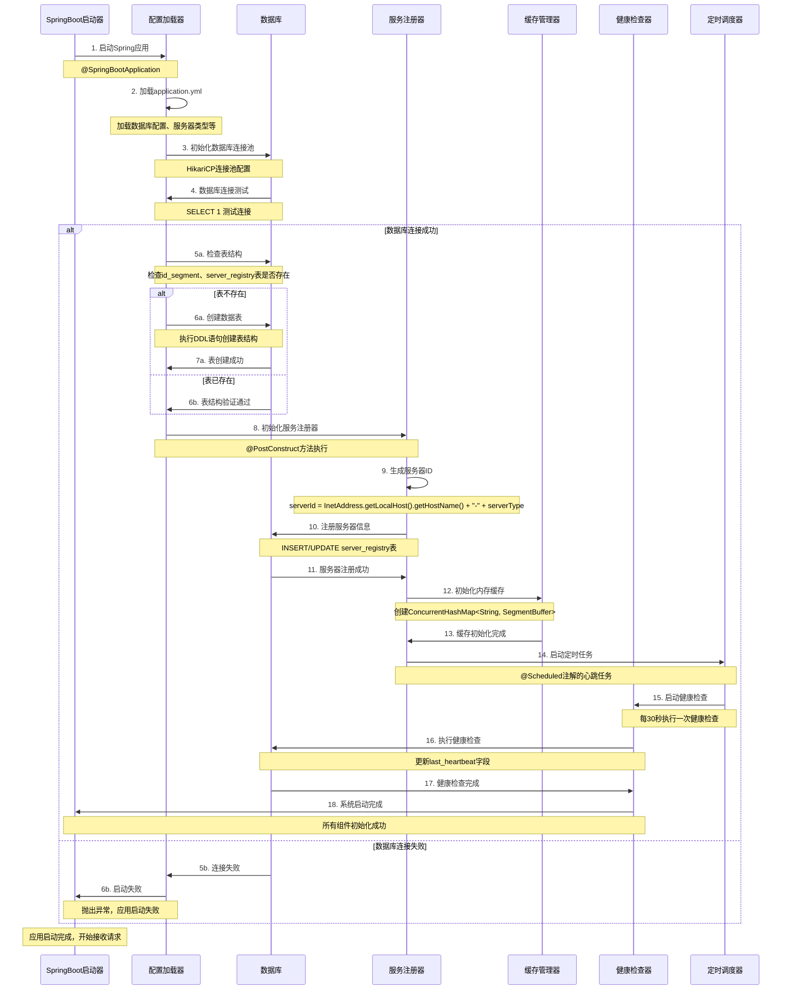
```mermaid
sequenceDiagram
    participant SB as SpringBoot启动器
    participant Config as 配置加载器
    participant DB as 数据库
    participant SR as 服务注册器
    participant Cache as 缓存管理器
    participant Health as 健康检查器
    participant Schedule as 定时调度器

    SB->>Config: 1. 启动Spring应用
    Note over SB,Config: @SpringBootApplication

    Config->>Config: 2. 加载application.yml
    Note over Config: 加载数据库配置、服务器类型等

    Config->>DB: 3. 初始化数据库连接池
    Note over Config,DB: HikariCP连接池配置

    DB->>Config: 4. 数据库连接测试
    Note over DB,Config: SELECT 1 测试连接

    alt 数据库连接成功
        Config->>DB: 5a. 检查表结构
        Note over Config,DB: 检查id_segment、server_registry表是否存在

        alt 表不存在
            Config->>DB: 6a. 创建数据表
            Note over Config,DB: 执行DDL语句创建表结构
            DB->>Config: 7a. 表创建成功
        else 表已存在
            DB->>Config: 6b. 表结构验证通过
        end

        Config->>SR: 8. 初始化服务注册器
        Note over Config,SR: @PostConstruct方法执行

        SR->>SR: 9. 生成服务器ID
        Note over SR: serverId = InetAddress.getLocalHost().getHostName() + "-" + serverType

        SR->>DB: 10. 注册服务器信息
        Note over SR,DB: INSERT/UPDATE server_registry表

        DB->>SR: 11. 服务器注册成功

        SR->>Cache: 12. 初始化内存缓存
        Note over SR,Cache: 创建ConcurrentHashMap<String, SegmentBuffer>

        Cache->>SR: 13. 缓存初始化完成

        SR->>Schedule: 14. 启动定时任务
        Note over SR,Schedule: @Scheduled注解的心跳任务

        Schedule->>Health: 15. 启动健康检查
        Note over Schedule,Health: 每30秒执行一次健康检查

        Health->>DB: 16. 执行健康检查
        Note over Health,DB: 更新last_heartbeat字段

        DB->>Health: 17. 健康检查完成

        Health->>SB: 18. 系统启动完成
        Note over Health,SB: 所有组件初始化成功

    else 数据库连接失败
        DB->>Config: 5b. 连接失败
        Config->>SB: 6b. 启动失败
        Note over Config,SB: 抛出异常，应用启动失败
    end

    Note over SB: 应用启动完成，开始接收请求
```

---

## 7. 完整系统交互流程

### 7.1 ASCII版本 (综合流程)

```
客户端    负载均衡    业务服务器    内存缓存    奇偶服务器    数据库    监控系统    注册中心
  |          |          |          |          |          |          |          |
  |--请求--->|          |          |          |          |          |          |
  |          |--路由--->|          |          |          |          |          |
  |          |          |--检查--->|          |          |          |          |
  |          |          |          |--缓存--->|          |          |          |
  |          |          |          |          |--查询--->|          |          |
  |          |          |          |          |          |--事务--->|          |
  |          |          |          |          |          |<--结果---|          |
  |          |          |          |          |<--号段---|          |          |
  |          |          |          |<--更新---|          |          |          |
  |          |          |<--ID-----|          |          |          |          |
  |          |<--响应---|          |          |          |          |          |
  |<--结果---|          |          |          |          |          |          |
  |          |          |          |          |          |          |          |
  |          |          |--心跳--->|          |          |          |          |
  |          |          |          |          |          |          |--监控--->|
  |          |          |          |          |          |          |          |--注册-->|
  |          |          |          |          |          |          |          |<--确认--|
  |          |          |          |          |          |          |<--状态---|          |
  |          |          |          |          |          |          |          |
```

### 7.2 Mermaid版本 (综合流程)

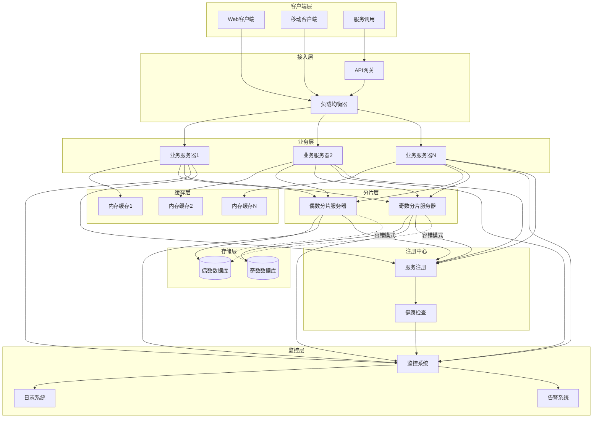
```mermaid
graph TB
    subgraph "客户端层"
        C1[Web客户端]
        C2[移动客户端] 
        C3[服务调用]
    end
    
    subgraph "接入层"
        LB[负载均衡器]
        GW[API网关]
    end
    
    subgraph "业务层"
        BS1[业务服务器1]
        BS2[业务服务器2]
        BS3[业务服务器N]
    end
    
    subgraph "缓存层"
        MC1[内存缓存1]
        MC2[内存缓存2]
        MC3[内存缓存N]
    end
    
    subgraph "分片层"
        ES[偶数分片服务器]
        OS[奇数分片服务器]
    end
    
    subgraph "存储层"
        DB1[(偶数数据库)]
        DB2[(奇数数据库)]
    end
    
    subgraph "监控层"
        MON[监控系统]
        LOG[日志系统]
        ALERT[告警系统]
    end
    
    subgraph "注册中心"
        REG[服务注册]
        HEALTH[健康检查]
    end
    
    %% 请求流向
    C1 --> LB
    C2 --> LB  
    C3 --> GW
    GW --> LB
    
    LB --> BS1
    LB --> BS2
    LB --> BS3
    
    BS1 --> MC1
    BS2 --> MC2
    BS3 --> MC3
    
    BS1 --> ES
    BS1 --> OS
    BS2 --> ES
    BS2 --> OS
    BS3 --> ES
    BS3 --> OS
    
    ES --> DB1
    OS --> DB2
    
    %% 监控流向
    BS1 --> MON
    BS2 --> MON
    BS3 --> MON
    ES --> MON
    OS --> MON
    
    MON --> LOG
    MON --> ALERT
    
    %% 注册流向
    BS1 --> REG
    BS2 --> REG
    BS3 --> REG
    ES --> REG
    OS --> REG
    
    REG --> HEALTH
    HEALTH --> MON
    
    %% 容错流向
    ES -.->|容错模式| DB2
    OS -.->|容错模式| DB1
```

---

## 8. 性能优化时序图

### 8.1 Mermaid版本

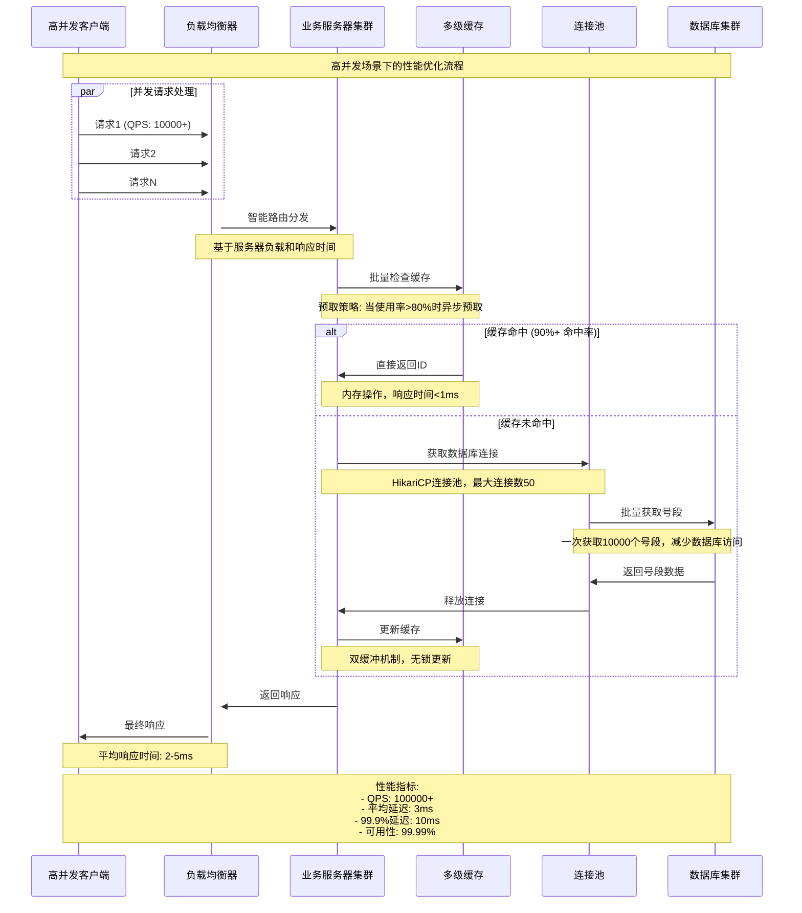
```mermaid
sequenceDiagram
    participant Client as 高并发客户端
    participant LB as 负载均衡器
    participant BS as 业务服务器集群
    participant Cache as 多级缓存
    participant Pool as 连接池
    participant DB as 数据库集群

    Note over Client,DB: 高并发场景下的性能优化流程

    par 并发请求处理
        Client->>+LB: 请求1 (QPS: 10000+)
        Client->>+LB: 请求2
        Client->>+LB: 请求N
    end

    LB->>BS: 智能路由分发
    Note over LB,BS: 基于服务器负载和响应时间

    BS->>Cache: 批量检查缓存
    Note over BS,Cache: 预取策略: 当使用率>80%时异步预取

    alt 缓存命中 (90%+ 命中率)
        Cache->>BS: 直接返回ID
        Note over Cache,BS: 内存操作，响应时间<1ms
    else 缓存未命中
        BS->>Pool: 获取数据库连接
        Note over BS,Pool: HikariCP连接池，最大连接数50
        
        Pool->>DB: 批量获取号段
        Note over Pool,DB: 一次获取10000个号段，减少数据库访问
        
        DB->>Pool: 返回号段数据
        Pool->>BS: 释放连接
        
        BS->>Cache: 更新缓存
        Note over BS,Cache: 双缓冲机制，无锁更新
    end

    BS->>LB: 返回响应
    LB->>Client: 最终响应
    Note over LB,Client: 平均响应时间: 2-5ms

    Note over Client,DB: 性能指标:<br/>- QPS: 100000+<br/>- 平均延迟: 3ms<br/>- 99.9%延迟: 10ms<br/>- 可用性: 99.99%
```

---

---

## 7. 步长变更流程

### 7.1 ASCII版本

```
管理员        管理接口        业务服务器        内存缓存        数据库        其他服务器实例
  |              |              |              |              |              |
  |--步长变更请求-→|              |              |              |              |
  |              |--参数验证----→|              |              |              |
  |              |              |--检查业务存在--→|              |              |
  |              |              |              |--查询当前配置--→|              |
  |              |              |              |              |←--返回配置----|
  |              |              |←--配置信息----|              |              |
  |              |←--验证结果----|              |              |              |
  |              |              |              |              |              |
  |--确认执行----→|              |              |              |              |
  |              |--开启事务----→|              |              |              |
  |              |              |--原子更新步长--→|              |              |
  |              |              |              |--UPDATE操作--→|              |
  |              |              |              |              |←--更新结果----|
  |              |              |--清理缓存----→|              |              |
  |              |              |              |--删除相关缓存--→|              |
  |              |              |              |←--清理完成----|              |
  |              |              |--提交事务----→|              |              |
  |              |              |              |--COMMIT-----→|              |
  |              |              |              |              |←--事务完成----|
  |              |              |              |              |              |
  |              |              |--通知其他实例--→|              |              |
  |              |              |              |              |              |--缓存失效通知--→|
  |              |              |              |              |              |←--确认收到------|
  |              |              |              |              |              |
  |              |←--变更完成----|              |              |              |
  |←--成功响应----|              |              |              |              |
  |              |              |              |              |              |
```

### 7.2 Mermaid版本

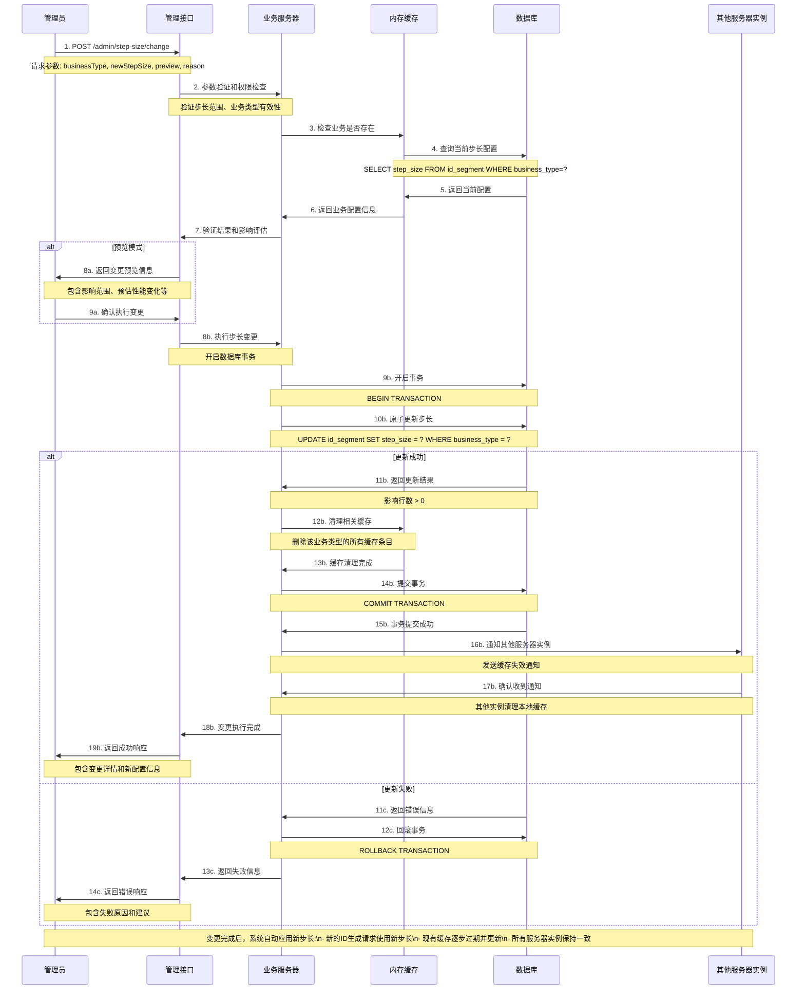
```mermaid
sequenceDiagram
    participant Admin as 管理员
    participant API as 管理接口
    participant BS as 业务服务器
    participant Cache as 内存缓存
    participant DB as 数据库
    participant Other as 其他服务器实例

    Admin->>API: 1. POST /admin/step-size/change
    Note over Admin,API: 请求参数: businessType, newStepSize, preview, reason

    API->>BS: 2. 参数验证和权限检查
    Note over API,BS: 验证步长范围、业务类型有效性

    BS->>Cache: 3. 检查业务是否存在
    Cache->>DB: 4. 查询当前步长配置
    Note over Cache,DB: SELECT step_size FROM id_segment WHERE business_type=?

    DB->>Cache: 5. 返回当前配置
    Cache->>BS: 6. 返回业务配置信息
    BS->>API: 7. 验证结果和影响评估

    alt 预览模式
        API->>Admin: 8a. 返回变更预览信息
        Note over API,Admin: 包含影响范围、预估性能变化等
        Admin->>API: 9a. 确认执行变更
    end

    API->>BS: 8b. 执行步长变更
    Note over API,BS: 开启数据库事务

    BS->>DB: 9b. 开启事务
    Note over BS,DB: BEGIN TRANSACTION

    BS->>DB: 10b. 原子更新步长
    Note over BS,DB: UPDATE id_segment SET step_size = ? WHERE business_type = ?

    alt 更新成功
        DB->>BS: 11b. 返回更新结果
        Note over DB,BS: 影响行数 > 0

        BS->>Cache: 12b. 清理相关缓存
        Note over BS,Cache: 删除该业务类型的所有缓存条目

        Cache->>BS: 13b. 缓存清理完成
        
        BS->>DB: 14b. 提交事务
        Note over BS,DB: COMMIT TRANSACTION

        DB->>BS: 15b. 事务提交成功

        BS->>Other: 16b. 通知其他服务器实例
        Note over BS,Other: 发送缓存失效通知

        Other->>BS: 17b. 确认收到通知
        Note over Other,BS: 其他实例清理本地缓存

        BS->>API: 18b. 变更执行完成
        API->>Admin: 19b. 返回成功响应
        Note over API,Admin: 包含变更详情和新配置信息

    else 更新失败
        DB->>BS: 11c. 返回错误信息
        BS->>DB: 12c. 回滚事务
        Note over BS,DB: ROLLBACK TRANSACTION
        
        BS->>API: 13c. 返回失败信息
        API->>Admin: 14c. 返回错误响应
        Note over API,Admin: 包含失败原因和建议
    end

    Note over Admin,Other: 变更完成后，系统自动应用新步长:\n- 新的ID生成请求使用新步长\n- 现有缓存逐步过期并更新\n- 所有服务器实例保持一致
```

### 7.3 批量步长变更流程

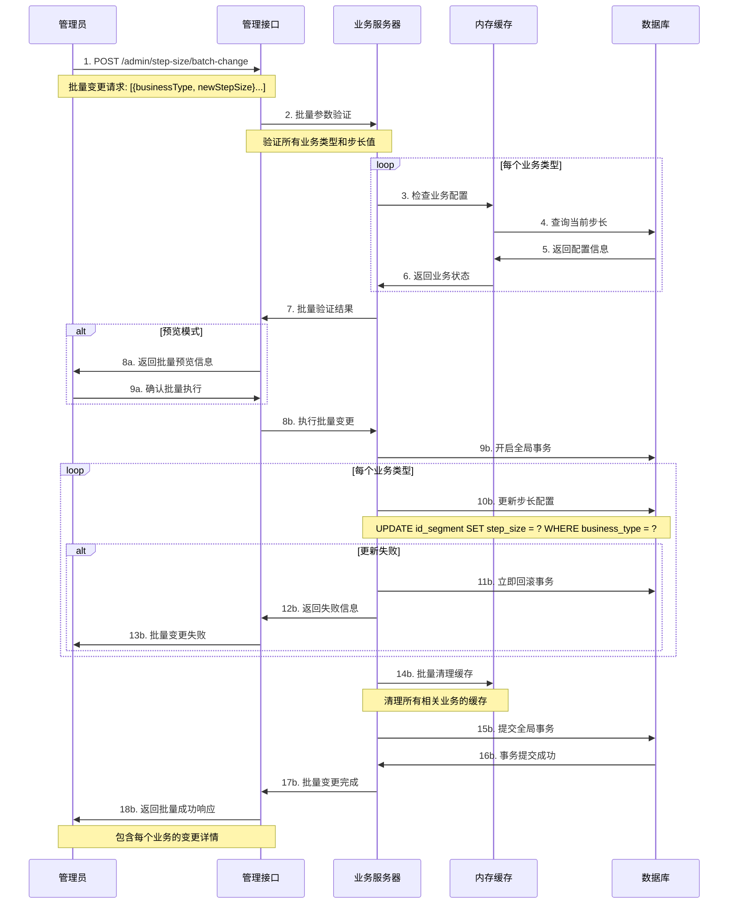
```mermaid
sequenceDiagram
    participant Admin as 管理员
    participant API as 管理接口
    participant BS as 业务服务器
    participant Cache as 内存缓存
    participant DB as 数据库

    Admin->>API: 1. POST /admin/step-size/batch-change
    Note over Admin,API: 批量变更请求: [{businessType, newStepSize}...]

    API->>BS: 2. 批量参数验证
    Note over API,BS: 验证所有业务类型和步长值

    loop 每个业务类型
        BS->>Cache: 3. 检查业务配置
        Cache->>DB: 4. 查询当前步长
        DB->>Cache: 5. 返回配置信息
        Cache->>BS: 6. 返回业务状态
    end

    BS->>API: 7. 批量验证结果
    
    alt 预览模式
        API->>Admin: 8a. 返回批量预览信息
        Admin->>API: 9a. 确认批量执行
    end

    API->>BS: 8b. 执行批量变更
    BS->>DB: 9b. 开启全局事务

    loop 每个业务类型
        BS->>DB: 10b. 更新步长配置
        Note over BS,DB: UPDATE id_segment SET step_size = ? WHERE business_type = ?
        
        alt 更新失败
            BS->>DB: 11b. 立即回滚事务
            BS->>API: 12b. 返回失败信息
            API->>Admin: 13b. 批量变更失败
        end
    end

    BS->>Cache: 14b. 批量清理缓存
    Note over BS,Cache: 清理所有相关业务的缓存

    BS->>DB: 15b. 提交全局事务
    DB->>BS: 16b. 事务提交成功

    BS->>API: 17b. 批量变更完成
    API->>Admin: 18b. 返回批量成功响应
    Note over API,Admin: 包含每个业务的变更详情
```

---

## 8. 多线程安全刷新机制

### 8.1 ASCII版本

```
线程1        线程2        线程3        SegmentBuffer    数据库        监控系统
  |              |              |              |              |              |
  |--检查阈值---->|              |              |              |              |
  |              |--检查阈值---->|              |              |              |
  |              |              |--检查阈值---->|              |              |
  |              |              |              |--超过阈值---->|              |
  |              |              |              |              |              |
  |--尝试CAS设置->|              |              |              |              |
  |              |--尝试CAS设置->|              |              |              |
  |              |              |--尝试CAS设置->|              |              |
  |              |              |              |--CAS成功(线程1)->|              |
  |              |              |              |--CAS失败(线程2)->|              |
  |              |              |              |--CAS失败(线程3)->|              |
  |              |              |              |              |              |
  |--开始刷新---->|              |              |              |              |
  |              |--继续使用缓存->|              |              |              |
  |              |              |--继续使用缓存->|              |              |
  |              |              |              |              |              |
  |              |              |              |              |--刷新操作-->|
  |              |              |              |              |<--新号段----|              |
  |              |              |              |<--更新缓存--|              |              |
  |              |              |              |--重置标志位->|              |              |
  |              |              |              |              |              |
  |              |              |              |              |              |--监控状态-->|
  |              |              |              |              |              |<--正常状态--|
```

### 8.2 Mermaid版本

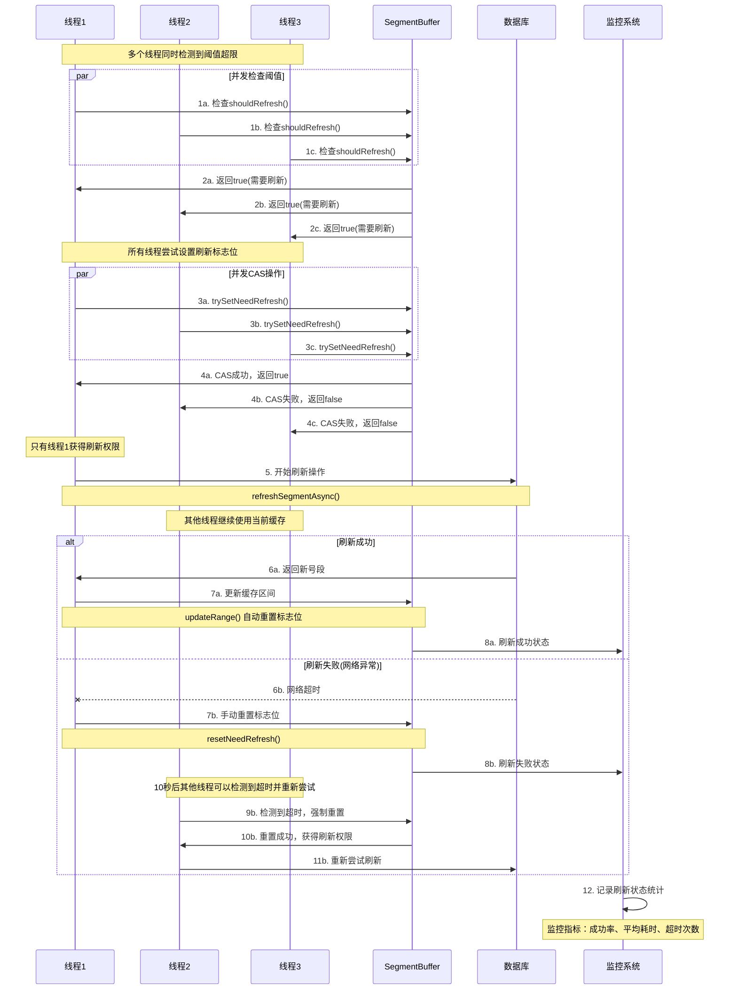
```mermaid
sequenceDiagram
    participant T1 as 线程1
    participant T2 as 线程2
    participant T3 as 线程3
    participant Buffer as SegmentBuffer
    participant DB as 数据库
    participant Monitor as 监控系统

    Note over T1,T3: 多个线程同时检测到阈值超限
    
    par 并发检查阈值
        T1->>Buffer: 1a. 检查shouldRefresh()
        T2->>Buffer: 1b. 检查shouldRefresh()
        T3->>Buffer: 1c. 检查shouldRefresh()
    end
    
    Buffer->>T1: 2a. 返回true(需要刷新)
    Buffer->>T2: 2b. 返回true(需要刷新)
    Buffer->>T3: 2c. 返回true(需要刷新)
    
    Note over T1,T3: 所有线程尝试设置刷新标志位
    
    par 并发CAS操作
        T1->>Buffer: 3a. trySetNeedRefresh()
        T2->>Buffer: 3b. trySetNeedRefresh()
        T3->>Buffer: 3c. trySetNeedRefresh()
    end
    
    Buffer->>T1: 4a. CAS成功，返回true
    Buffer->>T2: 4b. CAS失败，返回false
    Buffer->>T3: 4c. CAS失败，返回false
    
    Note over T1: 只有线程1获得刷新权限
    
    T1->>DB: 5. 开始刷新操作
    Note over T1,DB: refreshSegmentAsync()
    
    Note over T2,T3: 其他线程继续使用当前缓存
    
    alt 刷新成功
        DB->>T1: 6a. 返回新号段
        T1->>Buffer: 7a. 更新缓存区间
        Note over T1,Buffer: updateRange() 自动重置标志位
        Buffer->>Monitor: 8a. 刷新成功状态
        
    else 刷新失败(网络异常)
        DB--xT1: 6b. 网络超时
        T1->>Buffer: 7b. 手动重置标志位
        Note over T1,Buffer: resetNeedRefresh()
        Buffer->>Monitor: 8b. 刷新失败状态
        
        Note over T2,T3: 10秒后其他线程可以检测到超时并重新尝试
        
        T2->>Buffer: 9b. 检测到超时，强制重置
        Buffer->>T2: 10b. 重置成功，获得刷新权限
        T2->>DB: 11b. 重新尝试刷新
    end
    
    Monitor->>Monitor: 12. 记录刷新状态统计
    Note over Monitor: 监控指标：成功率、平均耗时、超时次数
```

## 9. 智能负载均衡流程

### 9.1 ASCII版本

```
客户端        业务服务器        服务注册中心        数据库        负载分析器
  |              |              |              |              |
  |--ID请求----->|              |              |              |
  |              |--检查服务器状态->|              |              |
  |              |              |--查询在线服务器->|              |
  |              |              |<--返回服务器列表--|              |
  |              |<--服务器状态--|              |              |
  |              |              |              |              |
  |              |--查询负载情况-->|              |              |
  |              |              |              |--查询使用率-->|
  |              |              |              |<--返回负载数据--|
  |              |<--负载信息--|              |              |
  |              |              |              |              |
  |              |--智能选择分片-->|              |              |
  |              |              |              |              |--负载分析-->|
  |              |              |              |              |<--推荐分片--|
  |              |<--分片类型--|              |              |
  |              |              |              |              |
  |              |--获取号段---->|              |              |
  |              |              |              |--原子更新-->|
  |              |              |              |<--新号段----|              |
  |              |<--返回ID------|              |              |
  |<--响应ID----|              |              |              |
  |              |              |              |              |
```

### 9.2 Mermaid版本

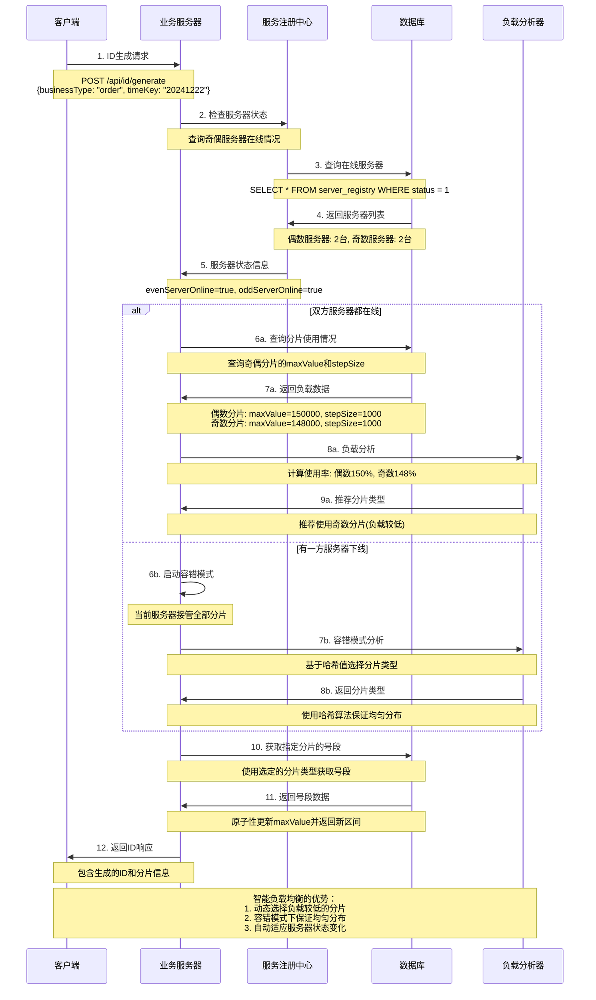
```mermaid
sequenceDiagram
    participant Client as 客户端
    participant BS as 业务服务器
    participant Registry as 服务注册中心
    participant DB as 数据库
    participant Analyzer as 负载分析器

    Client->>BS: 1. ID生成请求
    Note over Client,BS: POST /api/id/generate<br/>{businessType: "order", timeKey: "20241222"}
    
    BS->>Registry: 2. 检查服务器状态
    Note over BS,Registry: 查询奇偶服务器在线情况
    
    Registry->>DB: 3. 查询在线服务器
    Note over Registry,DB: SELECT * FROM server_registry WHERE status = 1
    
    DB->>Registry: 4. 返回服务器列表
    Note over DB,Registry: 偶数服务器: 2台, 奇数服务器: 2台
    
    Registry->>BS: 5. 服务器状态信息
    Note over Registry,BS: evenServerOnline=true, oddServerOnline=true
    
    alt 双方服务器都在线
        BS->>DB: 6a. 查询分片使用情况
        Note over BS,DB: 查询奇偶分片的maxValue和stepSize
        
        DB->>BS: 7a. 返回负载数据
        Note over DB,BS: 偶数分片: maxValue=150000, stepSize=1000<br/>奇数分片: maxValue=148000, stepSize=1000
        
        BS->>Analyzer: 8a. 负载分析
        Note over BS,Analyzer: 计算使用率: 偶数150%, 奇数148%
        
        Analyzer->>BS: 9a. 推荐分片类型
        Note over Analyzer,BS: 推荐使用奇数分片(负载较低)
        
    else 有一方服务器下线
        BS->>BS: 6b. 启动容错模式
        Note over BS: 当前服务器接管全部分片
        
        BS->>Analyzer: 7b. 容错模式分析
        Note over BS,Analyzer: 基于哈希值选择分片类型
        
        Analyzer->>BS: 8b. 返回分片类型
        Note over Analyzer,BS: 使用哈希算法保证均匀分布
    end
    
    BS->>DB: 10. 获取指定分片的号段
    Note over BS,DB: 使用选定的分片类型获取号段
    
    DB->>BS: 11. 返回号段数据
    Note over DB,BS: 原子性更新maxValue并返回新区间
    
    BS->>Client: 12. 返回ID响应
    Note over BS,Client: 包含生成的ID和分片信息
    
    Note over Client,Analyzer: 智能负载均衡的优势：<br/>1. 动态选择负载较低的分片<br/>2. 容错模式下保证均匀分布<br/>3. 自动适应服务器状态变化
```

## 10. 容错恢复与冲突解决流程

### 10.1 Mermaid版本

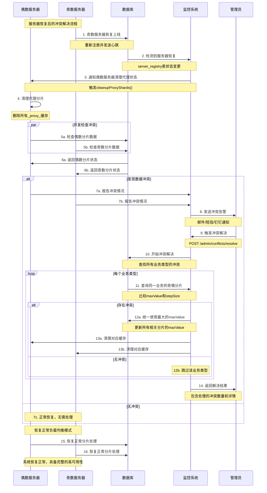
```mermaid
sequenceDiagram
    participant ES as 偶数服务器
    participant OS as 奇数服务器
    participant DB as 数据库
    participant Monitor as 监控系统
    participant Admin as 管理员

    Note over ES,OS: 服务器恢复后的冲突解决流程
    
    OS->>DB: 1. 奇数服务器恢复上线
    Note over OS,DB: 重新注册并发送心跳
    
    DB->>Monitor: 2. 检测到服务器恢复
    Note over DB,Monitor: server_registry表状态变更
    
    Monitor->>ES: 3. 通知偶数服务器清理代理状态
    Note over Monitor,ES: 触发cleanupProxyShards()
    
    ES->>ES: 4. 清理代理分片
    Note over ES: 删除所有_proxy_缓存
    
    par 并发检查冲突
        ES->>DB: 5a. 检查偶数分片数据
        OS->>DB: 5b. 检查奇数分片数据
    end
    
    DB->>ES: 6a. 返回偶数分片状态
    DB->>OS: 6b. 返回奇数分片状态
    
    alt 发现数据冲突
        ES->>Monitor: 7a. 报告冲突情况
        OS->>Monitor: 7b. 报告冲突情况
        
        Monitor->>Admin: 8. 发送冲突告警
        Note over Monitor,Admin: 邮件/短信/钉钉通知
        
        Admin->>Monitor: 9. 触发冲突解决
        Note over Admin,Monitor: POST /admin/conflicts/resolve
        
        Monitor->>DB: 10. 开始冲突解决
        Note over Monitor,DB: 查找所有业务类型的冲突
        
        loop 每个业务类型
            DB->>Monitor: 11. 查询同一业务的奇偶分片
            Note over DB,Monitor: 比较maxValue和stepSize
            
            alt 存在冲突
                Monitor->>DB: 12a. 统一使用最大的maxValue
                Note over Monitor,DB: 更新所有相关分片的maxValue
                
                Monitor->>ES: 13a. 清理对应缓存
                Monitor->>OS: 13b. 清理对应缓存
                
            else 无冲突
                Note over Monitor: 12b. 跳过该业务类型
            end
        end
        
        Monitor->>Admin: 14. 返回解决结果
        Note over Monitor,Admin: 包含处理的冲突数量和详情
        
    else 无冲突
        Note over ES,OS: 7c. 正常恢复，无需处理
    end
    
    Note over ES,OS: 恢复正常负载均衡模式
    
    ES->>DB: 15. 恢复正常分片处理
    OS->>DB: 16. 恢复正常分片处理
    
    Note over ES,OS: 系统恢复正常，具备完整的高可用性
```

## 总结

以上时序图详细展示了分布式ID生成器系统的各个核心流程：

1. **正常ID生成流程**：展示了从客户端请求到返回ID的完整链路
2. **号段刷新流程**：说明了如何通过异步预取和原子更新保证高性能
3. **服务器注册与心跳流程**：展示了服务发现和健康检查机制
4. **容错切换流程**：说明了奇偶分片服务器的容错机制
5. **批量ID生成流程**：展示了高并发场景下的批量处理优化
6. **系统启动初始化流程**：说明了系统启动时的各个初始化步骤
7. **步长变更流程**：展示了在线安全变更步长的完整流程，包括单个和批量变更
8. **多线程安全刷新机制**：展示了CAS+超时恢复的完整机制，解决网络异常问题
9. **智能负载均衡流程**：说明了基于实际负载的动态分片选择算法
10. **容错恢复与冲突解决流程**：展示了服务器恢复后的自动冲突检测和解决机制

### 技术亮点

这些时序图突出了系统的几个技术亮点：

1. **多线程安全设计**：通过CAS操作和超时恢复机制，完美解决了并发刷新问题
2. **智能负载均衡**：不再依赖简单的哈希分配，而是基于实际负载情况动态选择
3. **全面容错设计**：从网络异常到服务器故障，再到数据冲突，都有完整的处理机制
4. **生产级运维**：支持在线参数调整、实时状态监控、自动故障恢复等功能

这些时序图涵盖了系统的所有关键场景，可以帮助开发人员和运维人员更好地理解系统的工作原理和交互流程。特别是新增的多线程安全和智能负载均衡功能，使得系统具备了更强的稳定性和适应性。