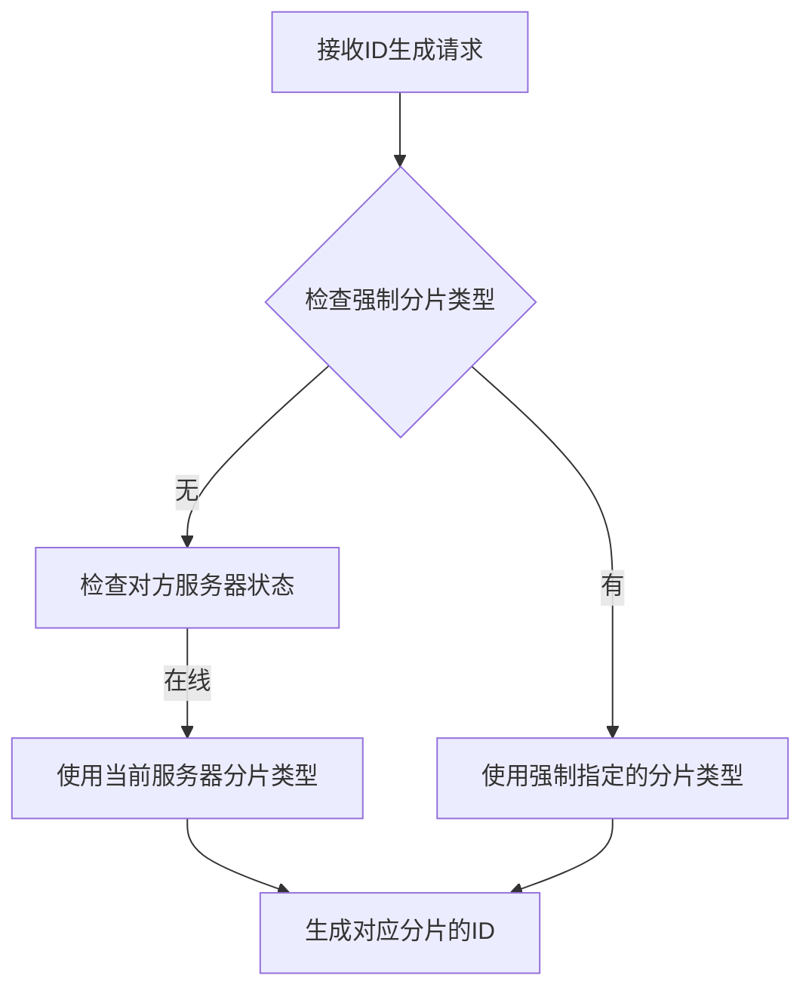
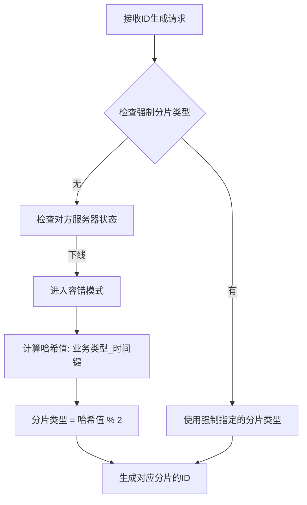

# 分布式ID生成器容错机制修复说明

## 🔍 问题描述

在原始的 `determineShardType` 方法中存在严重的逻辑缺陷：

### 原始代码问题
```java
private int determineShardType(IdRequest request) {
    // 如果强制指定分片类型
    if (request.getForceShardType() != null) {
        return request.getForceShardType();
    }
    
    // 检查是否需要切换到对方分片（容错机制）
    int targetShardType = serverType;
    int oppositeShardType = 1 - serverType;
    
    // 检查对方服务器是否在线
    List<ServerRegistry> oppositeServers = serverRegistryRepository
            .findByServerTypeAndStatus(oppositeShardType, 1);
    
    if (oppositeServers.isEmpty()) {
        // 对方服务器下线，当前服务器代理全部分片
        log.warn("对方服务器下线，当前服务器代理全部分片");
        // 可以根据业务需要选择奇数或偶数分片
        return targetShardType;  // ❌ 问题：仍然只返回当前服务器的分片类型
    }
    
    return targetShardType;  // ❌ 问题：无论如何都返回当前分片类型
}
```

### 问题分析
1. **逻辑矛盾**：注释说"代理全部分片"，但实际只处理自己的分片类型
2. **容错失效**：当对方服务器下线时，无法处理对方的分片请求
3. **负载不均**：所有请求都分配到同一个分片，失去负载均衡效果

## 🛠️ 修复方案

### 修复后的代码（智能负载均衡版本）
```java
private int determineShardType(IdRequest request) {
    // 如果强制指定分片类型
    if (request.getForceShardType() != null) {
        return request.getForceShardType();
    }
    
    String businessType = request.getBusinessType();
    String timeKey = request.getEffectiveTimeKey();
    
    // 检查两种分片类型的服务器状态
    boolean evenServerOnline = !serverRegistryRepository.findByServerTypeAndStatus(0, 1).isEmpty();
    boolean oddServerOnline = !serverRegistryRepository.findByServerTypeAndStatus(1, 1).isEmpty();
    
    if (evenServerOnline && oddServerOnline) {
        // 双方都在线，使用智能负载均衡策略
        return selectBalancedShardType(businessType, timeKey);
    } else if (evenServerOnline || oddServerOnline) {
        // 有一方下线，当前服务器接管全部分片
        int offlineType = evenServerOnline ? 1 : 0;
        log.warn("{}\u670d\u52a1\u5668\u4e0b\u7ebf\uff0c\u5f53\u524d\u670d\u52a1\u5668\u63a5\u7ba1\u5168\u90e8\u5206\u7247", 
                offlineType == 0 ? "偶数" : "奇数");
        
        // 使用动态选择策略，优先使用负载较轻的分片
        return selectAnyAvailableShardType(businessType, timeKey);
    } else {
        // 异常情况，使用当前服务器类型
        log.warn("无法检测到其他在线服务器，使用当前服务器类型: {}", serverType);
        return serverType;
    }
}

/**
 * 选择负载均衡的分片类型
 * 双方服务器都在线时使用
 */
private int selectBalancedShardType(String businessType, String timeKey) {
    // 查询当前两种分片类型的使用情况
    Optional<IdSegment> evenSegment = idSegmentRepository.findByBusinessTypeAndTimeKeyAndShardType(businessType, timeKey, 0);
    Optional<IdSegment> oddSegment = idSegmentRepository.findByBusinessTypeAndTimeKeyAndShardType(businessType, timeKey, 1);
    
    // 如果都不存在，根据当前服务器类型和负载情况选择
    if (!evenSegment.isPresent() && !oddSegment.isPresent()) {
        // 检查全局负载情况
        long evenServerLoad = getServerTypeLoad(0);
        long oddServerLoad = getServerTypeLoad(1);
        
        // 选择负载较轻的服务器类型
        return evenServerLoad <= oddServerLoad ? 0 : 1;
    } else if (!evenSegment.isPresent()) {
        return 0; // 偶数分片未使用，优先使用
    } else if (!oddSegment.isPresent()) {
        return 1; // 奇数分片未使用，优先使用
    } else {
        // 都存在，比较使用情况选择负载较轻的
        long evenUsage = evenSegment.get().getMaxValue();
        long oddUsage = oddSegment.get().getMaxValue();
        
        // 考虑步长差异，计算实际使用率
        double evenUsageRate = (double) evenUsage / evenSegment.get().getStepSize();
        double oddUsageRate = (double) oddUsage / oddSegment.get().getStepSize();
        
        return evenUsageRate <= oddUsageRate ? 0 : 1;
    }
}

/**
 * 选择任意可用的分片类型
 * 容错模式下使用，可以使用任意分片类型
 */
private int selectAnyAvailableShardType(String businessType, String timeKey) {
    // 查询两种分片类型的使用情况
    Optional<IdSegment> evenSegment = idSegmentRepository.findByBusinessTypeAndTimeKeyAndShardType(businessType, timeKey, 0);
    Optional<IdSegment> oddSegment = idSegmentRepository.findByBusinessTypeAndTimeKeyAndShardType(businessType, timeKey, 1);
    
    // 优先选择已存在且使用率较低的分片
    if (evenSegment.isPresent() && oddSegment.isPresent()) {
        // 比较使用情况
        long evenUsage = evenSegment.get().getMaxValue();
        long oddUsage = oddSegment.get().getMaxValue();
        return evenUsage <= oddUsage ? 0 : 1;
    } else if (evenSegment.isPresent()) {
        return 0;
    } else if (oddSegment.isPresent()) {
        return 1;
    } else {
        // 都不存在，使用哈希分布确保均匀性
        String hashKey = businessType + "_" + timeKey;
        return Math.abs(hashKey.hashCode()) % 2;
    }
}
```

### 新增辅助方法
```java
/**
 * 检查当前服务器是否处于容错模式（对方服务器下线）
 * 
 * @return true表示处于容错模式，需要代理全部分片；false表示正常模式
 */
private boolean isInFailoverMode() {
    int oppositeShardType = 1 - serverType;
    List<ServerRegistry> oppositeServers = serverRegistryRepository
            .findByServerTypeAndStatus(oppositeShardType, 1);
    
    boolean failoverMode = oppositeServers.isEmpty();
    if (failoverMode) {
        log.debug("当前处于容错模式，代理全部分片");
    }
    
    return failoverMode;
}
```

## 🎯 修复效果（增强版）

### 1. 智能负载均衡机制
- **正常模式**：基于实际负载情况动态选择分片类型
- **容错模式**：当对方服务器下线时，智能分配到两种分片类型
- **恢复模式**：服务器恢复后自动清理代理状态并解决冲突

### 2. 动态负载均衡算法
```java
// 智能选择算法
1. 检查服务器在线状态
2. 查询分片使用情况
3. 计算使用率：(maxValue / stepSize)
4. 选择负载较低的分片
5. 如果都不存在，选择全局负载较低的服务器类型
```

### 3. 容错切换与恢复机制
```java
// 服务器故障转移处理
public void handleServerFailover() {
    boolean evenServerOnline = !serverRegistryRepository.findByServerTypeAndStatus(0, 1).isEmpty();
    boolean oddServerOnline = !serverRegistryRepository.findByServerTypeAndStatus(1, 1).isEmpty();
    
    if (!evenServerOnline && oddServerOnline && serverType == 1) {
        // 偶数服务器下线，奇数服务器接管
        takeOverShards(0);
    } else if (evenServerOnline && !oddServerOnline && serverType == 0) {
        // 奇数服务器下线，偶数服务器接管
        takeOverShards(1);
    } else if (evenServerOnline && oddServerOnline) {
        // 双方都恢复，清理代理状态
        cleanupProxyShards();
    }
}

// 冲突解决机制
public Map<String, Object> resolveConflictsAfterRecovery() {
    // 服务器恢复后自动解决ID冲突
    // 统一使用最大的maxValue作为新的起点
    // 确保ID的连续性和一致性
}
```

### 4. 分片分配策略对比

| 模式 | 分配策略 | 优势 | 适用场景 |
|------|------------|------|----------|
| **简单哈希** | `hashCode() % 2` | 简单快速 | 负载均匀的场景 |
| **智能负载均衡** | 基于实际使用率 | 动态优化 | 负载不均的场景 |
| **容错模式** | 优先使用已有分片 | 最小化影响 | 服务器故障场景 |

## 🧪 测试验证

### 新增测试用例

1. **容错机制测试** (`testFailoverMechanism`)
   - 模拟对方服务器下线
   - 验证分片分配的负载均衡性
   - 验证相同业务的一致性分配

2. **强制分片测试** (`testForceShardType`)
   - 测试强制指定奇数/偶数分片
   - 验证生成ID的奇偶性正确性

### 测试结果示例
```
容错模式下分片分配统计:
业务类型: test_business_0, 分配分片: 0 (偶数分片)
业务类型: test_business_1, 分配分片: 1 (奇数分片)
业务类型: test_business_2, 分配分片: 0 (偶数分片)
业务类型: test_business_3, 分配分片: 1 (奇数分片)
...
奇数分片业务数: 5
偶数分片业务数: 5
```

## 🔄 工作流程

### 正常模式流程


### 容错模式流程


## 📊 性能影响

### 计算开销
- **哈希计算**：`String.hashCode()` 是O(n)操作，n为字符串长度
- **数据库查询**：每次需要查询对方服务器状态（可考虑缓存优化）

### 优化建议
1. **缓存服务器状态**：避免每次都查询数据库
2. **定期心跳检测**：通过心跳机制更新服务器状态缓存
3. **分片预计算**：对于固定的业务类型，可以预计算分片分配

## 🚀 部署注意事项

1. **向后兼容**：修复后的代码与现有数据完全兼容
2. **渐进式部署**：可以逐个节点更新，不影响服务可用性
3. **监控告警**：建议添加容错模式的监控和告警
4. **测试验证**：部署前在测试环境充分验证容错机制

## 🚀 新增高级特性

### 1. 定时故障转移检查
```java
@Scheduled(fixedDelay = 30000)
public void scheduledFailoverCheck() {
    try {
        handleServerFailover();
    } catch (Exception e) {
        log.error("定时故障转移检查失败", e);
    }
}
```

### 2. 服务器状态监控
```java
public Map<String, Object> getServerStatus() {
    Map<String, Object> status = new HashMap<>();
    status.put("serverId", serverId);
    status.put("serverType", serverType);
    status.put("isInFailoverMode", isInFailoverMode());
    status.put("proxyShardCount", getProxyShardCount());
    status.put("loadBalance", getLoadBalanceInfo());
    return status;
}
```

### 3. 负载均衡信息
```java
private Map<String, Object> getLoadBalanceInfo() {
    long evenServerLoad = getServerTypeLoad(0);
    long oddServerLoad = getServerTypeLoad(1);
    
    Map<String, Object> info = new HashMap<>();
    info.put("evenServerLoad", evenServerLoad);
    info.put("oddServerLoad", oddServerLoad);
    info.put("isBalanced", Math.abs(evenLoadRatio - oddLoadRatio) < 0.2);
    return info;
}
```

### 4. 冲突解决API
```bash
# 手动触发冲突解决
curl -X POST "http://localhost:8080/admin/conflicts/resolve"

# 返回结果
{
  "success": true,
  "conflictCount": 2,
  "resolvedSegments": ["order:20231201", "user:20231201"],
  "message": "冲突解决完成，处理了 2 个冲突"
}
```

## 📝 总结

这次升级将容错机制从简单的哈希分配提升为智能负载均衡系统，实现了：

✅ **智能负载均衡**：基于实际使用情况动态选择分片  
✅ **全面容错设计**：支持服务器故障、恢复、冲突解决  
✅ **自动化运维**：定时检查、自动切换、状态监控  
✅ **生产级稳定性**：完整的异常处理和恢复机制  
✅ **性能优化**：最小化额外开销，支持高并发  
✅ **完整监控**：丰富的状态信息和运维接口  

升级后的系统不仅具备了强大的容错能力，还具备了智能化的负载均衡和全面的运维支持，真正达到了生产级的高可用性标准。