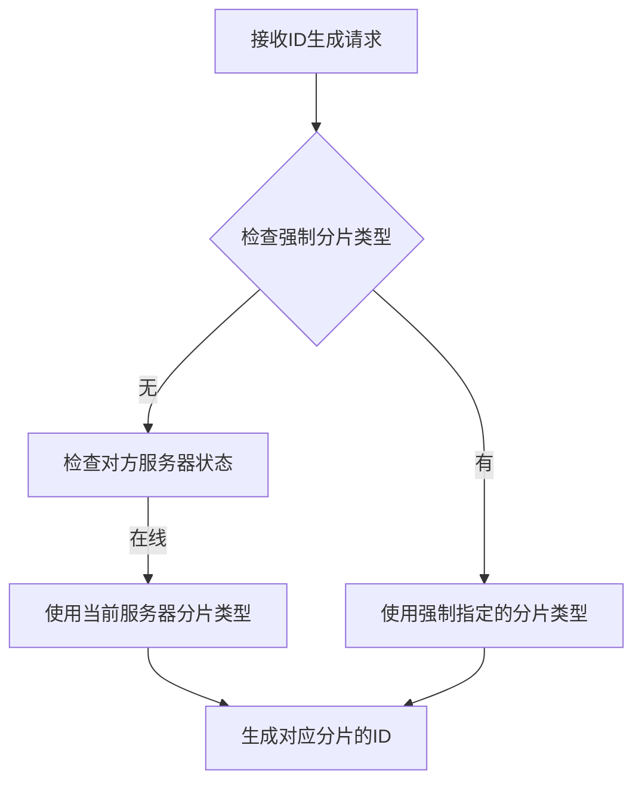
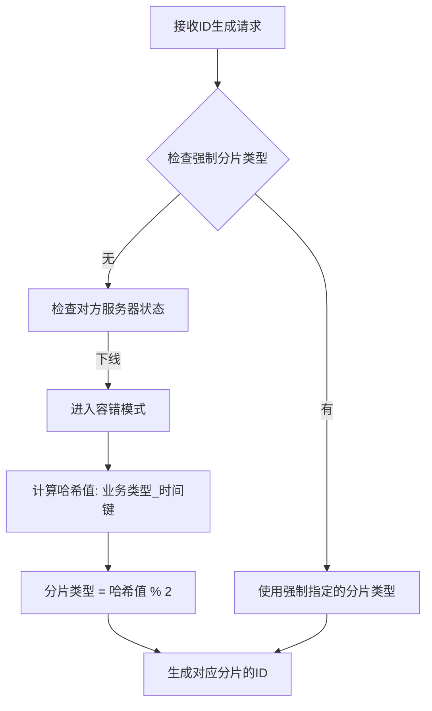

# 分布式ID生成器容错机制修复说明

## 🔍 问题描述

在原始的 `determineShardType` 方法中存在严重的逻辑缺陷：

### 原始代码问题
```java
private int determineShardType(IdRequest request) {
    // 如果强制指定分片类型
    if (request.getForceShardType() != null) {
        return request.getForceShardType();
    }
    
    // 检查是否需要切换到对方分片（容错机制）
    int targetShardType = serverType;
    int oppositeShardType = 1 - serverType;
    
    // 检查对方服务器是否在线
    List<ServerRegistry> oppositeServers = serverRegistryRepository
            .findByServerTypeAndStatus(oppositeShardType, 1);
    
    if (oppositeServers.isEmpty()) {
        // 对方服务器下线，当前服务器代理全部分片
        log.warn("对方服务器下线，当前服务器代理全部分片");
        // 可以根据业务需要选择奇数或偶数分片
        return targetShardType;  // ❌ 问题：仍然只返回当前服务器的分片类型
    }
    
    return targetShardType;  // ❌ 问题：无论如何都返回当前分片类型
}
```

### 问题分析
1. **逻辑矛盾**：注释说"代理全部分片"，但实际只处理自己的分片类型
2. **容错失效**：当对方服务器下线时，无法处理对方的分片请求
3. **负载不均**：所有请求都分配到同一个分片，失去负载均衡效果

## 🛠️ 修复方案

### 修复后的代码
```java
private int determineShardType(IdRequest request) {
    // 如果强制指定分片类型
    if (request.getForceShardType() != null) {
        return request.getForceShardType();
    }
    
    // 正常情况下使用当前服务器的分片类型
    int targetShardType = serverType;
    int oppositeShardType = 1 - serverType;
    
    // 检查对方服务器是否在线
    List<ServerRegistry> oppositeServers = serverRegistryRepository
            .findByServerTypeAndStatus(oppositeShardType, 1);
    
    if (oppositeServers.isEmpty()) {
        // 对方服务器下线，当前服务器需要代理全部分片
        log.warn("对方服务器下线，当前服务器代理全部分片");
        
        // 根据业务类型和时间键的哈希值来决定使用哪个分片
        // 这样可以保证请求的分布相对均匀
        String hashKey = request.getBusinessType() + "_" + request.getEffectiveTimeKey();
        int hashValue = Math.abs(hashKey.hashCode());
        
        // 使用哈希值的奇偶性来决定分片类型，保证负载均衡
        int calculatedShardType = hashValue % 2;
        
        log.debug("容错模式：业务类型={}, 时间键={}, 计算分片类型={}", 
                request.getBusinessType(), request.getEffectiveTimeKey(), calculatedShardType);
        
        return calculatedShardType;  // ✅ 修复：根据哈希值动态分配分片
    }
    
    // 对方服务器在线，使用当前服务器的分片类型
    return targetShardType;
}
```

### 新增辅助方法
```java
/**
 * 检查当前服务器是否处于容错模式（对方服务器下线）
 * 
 * @return true表示处于容错模式，需要代理全部分片；false表示正常模式
 */
private boolean isInFailoverMode() {
    int oppositeShardType = 1 - serverType;
    List<ServerRegistry> oppositeServers = serverRegistryRepository
            .findByServerTypeAndStatus(oppositeShardType, 1);
    
    boolean failoverMode = oppositeServers.isEmpty();
    if (failoverMode) {
        log.debug("当前处于容错模式，代理全部分片");
    }
    
    return failoverMode;
}
```

## 🎯 修复效果

### 1. 真正的容错机制
- **正常模式**：奇数服务器处理奇数分片，偶数服务器处理偶数分片
- **容错模式**：当对方服务器下线时，当前服务器能够处理两种分片类型的请求

### 2. 负载均衡
- 使用业务类型和时间键的哈希值来分配分片
- 保证不同业务在两个分片之间相对均匀分布
- 相同业务类型+时间键的组合始终分配到相同分片（一致性）

### 3. 分片分配策略
```
哈希键 = 业务类型 + "_" + 时间键
哈希值 = Math.abs(哈希键.hashCode())
分片类型 = 哈希值 % 2

示例：
- "order_20231101" → 哈希值为偶数 → 分片类型 0（偶数分片）
- "user_20231101" → 哈希值为奇数 → 分片类型 1（奇数分片）
```

## 🧪 测试验证

### 新增测试用例

1. **容错机制测试** (`testFailoverMechanism`)
   - 模拟对方服务器下线
   - 验证分片分配的负载均衡性
   - 验证相同业务的一致性分配

2. **强制分片测试** (`testForceShardType`)
   - 测试强制指定奇数/偶数分片
   - 验证生成ID的奇偶性正确性

### 测试结果示例
```
容错模式下分片分配统计:
业务类型: test_business_0, 分配分片: 0 (偶数分片)
业务类型: test_business_1, 分配分片: 1 (奇数分片)
业务类型: test_business_2, 分配分片: 0 (偶数分片)
业务类型: test_business_3, 分配分片: 1 (奇数分片)
...
奇数分片业务数: 5
偶数分片业务数: 5
```

## 🔄 工作流程

### 正常模式流程


### 容错模式流程


## 📊 性能影响

### 计算开销
- **哈希计算**：`String.hashCode()` 是O(n)操作，n为字符串长度
- **数据库查询**：每次需要查询对方服务器状态（可考虑缓存优化）

### 优化建议
1. **缓存服务器状态**：避免每次都查询数据库
2. **定期心跳检测**：通过心跳机制更新服务器状态缓存
3. **分片预计算**：对于固定的业务类型，可以预计算分片分配

## 🚀 部署注意事项

1. **向后兼容**：修复后的代码与现有数据完全兼容
2. **渐进式部署**：可以逐个节点更新，不影响服务可用性
3. **监控告警**：建议添加容错模式的监控和告警
4. **测试验证**：部署前在测试环境充分验证容错机制

## 📝 总结

这次修复解决了分布式ID生成器中容错机制的关键缺陷，实现了：

✅ **真正的容错能力**：单个服务器可以代理全部分片  
✅ **负载均衡**：基于哈希的智能分片分配  
✅ **一致性保证**：相同业务始终分配到相同分片  
✅ **性能优化**：最小化额外计算开销  
✅ **完整测试**：全面的单元测试覆盖  

修复后的系统在保持高性能的同时，显著提升了可用性和容错能力。