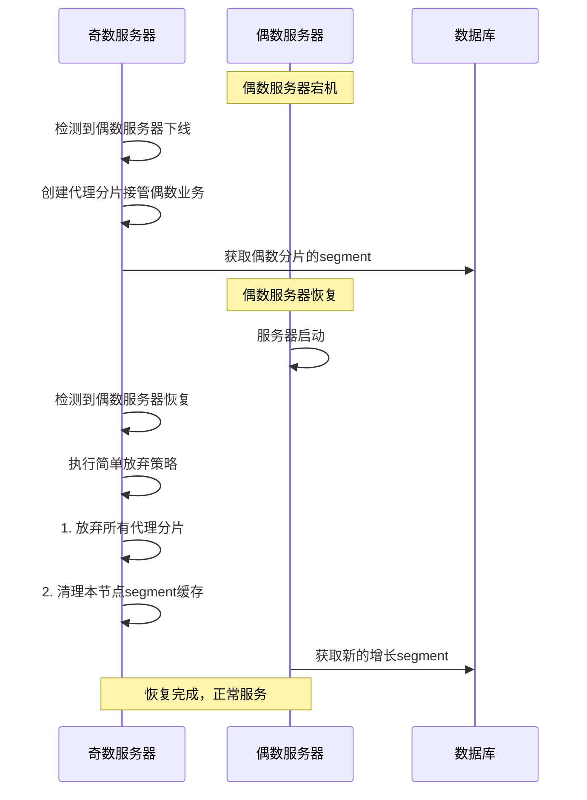

# 简单放弃策略使用指南

## 概述

简单放弃策略（Simple Abandon Strategy）是分布式ID生成器的一种服务器恢复机制，当挂掉的节点恢复后，**直接放弃现有的代理segment，允许ID浪费，恢复节点从数据库获取新的增长segment**。

## 设计理念

### 核心思想
- **简化优先**：避免复杂的ID回收和冲突解决机制
- **快速恢复**：恢复节点立即可用，无需等待复杂的同步过程
- **运维友好**：提供清晰的统计信息和管理接口

### 适用场景
- ✅ **高可用优先**：优先保证服务快速恢复
- ✅ **运维简化**：希望避免复杂的故障恢复流程
- ✅ **ID容忍**：业务对ID连续性要求不严格
- ❌ **零浪费要求**：如果业务严格要求零ID浪费，请使用复杂的回收策略

## 工作原理

### 故障转移流程



### 关键步骤

1. **检测服务器恢复**
   ```java
   boolean evenServerOnline = !serverRegistryRepository.findByServerTypeAndStatus(0, 1).isEmpty();
   boolean oddServerOnline = !serverRegistryRepository.findByServerTypeAndStatus(1, 1).isEmpty();
   boolean wasInFailoverMode = isInFailoverMode();
   ```

2. **执行简单放弃策略**
   ```java
   if (evenServerOnline && oddServerOnline && wasInFailoverMode) {
       // 放弃所有代理分片（允许ID浪费）
       simpleAbandonProxyShards();
       
       // 清理本节点的segment缓存，确保获取新的增长segment
       ensureRecoveredNodeGetsNewSegment();
   }
   ```

3. **统计ID浪费情况**
   ```java
   long abandonedIds = proxyBuffer.getMaxValue() - proxyBuffer.getCurrentValue();
   log.info("放弃代理分片: {}, 放弃ID数量: {}", proxyKey, abandonedIds);
   ```

## 管理API

### 1. 查看放弃策略状态

```bash
GET /admin/abandon/status
```

**响应示例**：
```json
{
    "proxyShardCount": 3,
    "totalAbandonableIds": 15000,
    "canUseAbandonStrategy": true,
    "isInFailoverMode": true,
    "proxyShardDetails": [
        {
            "key": "order_20241222_proxy_0",
            "shardType": 0,
            "currentValue": 85000,
            "maxValue": 90000,
            "abandonableIds": 5000
        },
        {
            "key": "user_20241222_proxy_0", 
            "shardType": 0,
            "currentValue": 120000,
            "maxValue": 130000,
            "abandonableIds": 10000
        }
    ],
    "timestamp": 1703234567890
}
```

### 2. 手动触发简单放弃策略

```bash
POST /admin/abandon/trigger
```

**响应示例**：
```json
{
    "success": true,
    "message": "简单放弃策略执行完成",
    "abandonedCount": 3,
    "timestamp": 1703234567890
}
```

### 3. 强制清理恢复节点缓存

```bash
POST /admin/cache/clean-recovered
```

**响应示例**：
```json
{
    "success": true,
    "message": "恢复节点缓存清理完成", 
    "cleanedCount": 5,
    "remainingCacheCount": 10,
    "timestamp": 1703234567890
}
```

## 监控指标

### 关键监控项

1. **代理分片数量**
   - 指标：`proxyShardCount`
   - 说明：当前接管的代理分片数量
   - 告警：> 0 表示处于容错模式

2. **可放弃ID数量**
   - 指标：`totalAbandonableIds`
   - 说明：如果执行放弃策略，将浪费的ID总数
   - 用途：评估放弃策略的成本

3. **容错模式状态**
   - 指标：`isInFailoverMode`
   - 说明：是否处于容错模式
   - 用途：判断是否可以执行放弃策略

### 日志监控

**关键日志模式**：
```bash
# 服务器恢复检测
"检测到服务器恢复，使用简单放弃策略清理代理状态"

# 代理分片放弃
"放弃代理分片: order_20241222_proxy_0, 放弃ID数量: 5000"

# 恢复完成
"服务器恢复完成，放弃了 3 个代理分片，总计放弃ID数量: 15000"
```

## 运维操作

### 日常检查

```bash
# 1. 检查服务器状态
curl -X GET http://localhost:8080/admin/server/status

# 2. 检查是否有代理分片
curl -X GET http://localhost:8080/admin/abandon/status

# 3. 如果有代理分片且对方服务器已恢复，手动触发放弃策略
curl -X POST http://localhost:8080/admin/abandon/trigger
```

### 故障恢复流程

1. **确认服务器恢复**
   ```bash
   # 检查所有服务器状态
   curl -X GET http://localhost:8080/admin/server/status
   ```

2. **评估ID浪费成本**
   ```bash
   # 查看将要放弃的ID数量
   curl -X GET http://localhost:8080/admin/abandon/status
   ```

3. **执行放弃策略**
   ```bash
   # 如果可以接受ID浪费，执行放弃策略
   curl -X POST http://localhost:8080/admin/abandon/trigger
   ```

4. **验证恢复结果**
   ```bash
   # 确认代理分片已清理
   curl -X GET http://localhost:8080/admin/server/status
   ```

## 与复杂策略的对比

| 特性 | 简单放弃策略 | 复杂回收策略 |
|------|-------------|-------------|
| **恢复速度** | ⚡ 极快（秒级） | 🐌 较慢（分钟级） |
| **ID浪费** | ❌ 有浪费 | ✅ 零浪费 |
| **实现复杂度** | ✅ 简单 | ❌ 复杂 |
| **运维难度** | ✅ 简单 | ❌ 复杂 |
| **并发安全** | ✅ 高 | ⚠️ 中等 |
| **适用场景** | 高可用优先 | 零浪费要求 |

## 最佳实践

### 1. 监控告警设置
```yaml
# Prometheus 告警规则示例
- alert: ProxyShardExists
  expr: proxy_shard_count > 0
  for: 5m
  labels:
    severity: warning
  annotations:
    summary: "检测到代理分片，可能需要执行恢复策略"
```

### 2. 自动化脚本
```bash
#!/bin/bash
# 自动检查并执行放弃策略

STATUS=$(curl -s http://localhost:8080/admin/abandon/status)
PROXY_COUNT=$(echo $STATUS | jq '.proxyShardCount')

if [ "$PROXY_COUNT" -gt 0 ]; then
    echo "检测到 $PROXY_COUNT 个代理分片，执行放弃策略..."
    curl -X POST http://localhost:8080/admin/abandon/trigger
fi
```

### 3. 业务影响评估
- **ID跳跃**：恢复后ID可能出现跳跃，业务需要能容忍
- **性能影响**：放弃策略执行期间可能有短暂的性能波动
- **数据一致性**：不影响数据一致性，只是ID范围有空隙

## 总结

简单放弃策略是一种**以简化运维为目标的服务器恢复机制**，通过允许少量ID浪费来换取快速恢复和简单运维。

**推荐使用场景**：
- 互联网业务（对ID连续性要求不严格）
- 高可用要求高的系统
- 运维资源有限的团队

**不推荐使用场景**：
- 金融业务（严格要求ID连续性）
- 审计要求严格的系统
- ID资源非常宝贵的场景