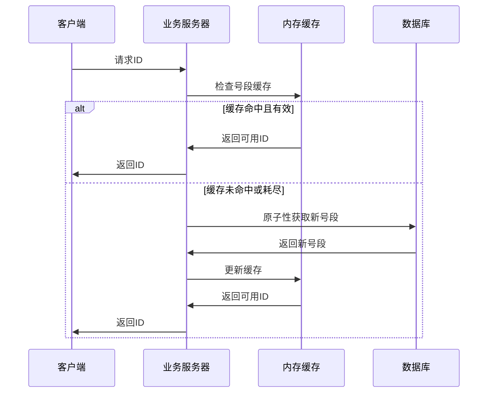
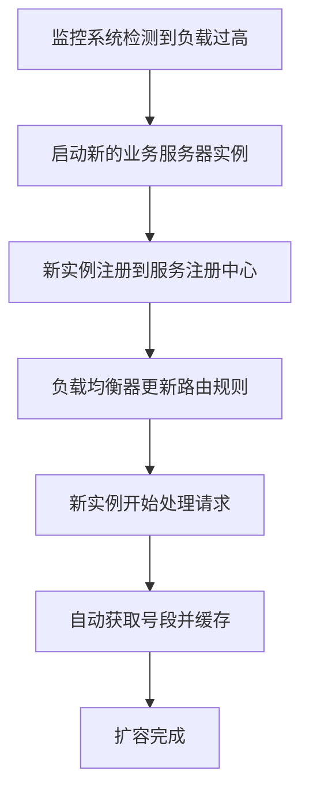
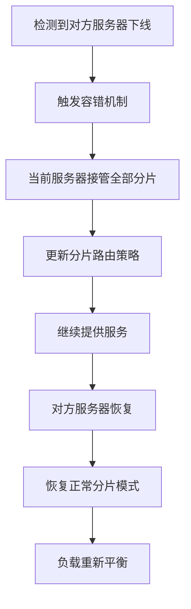
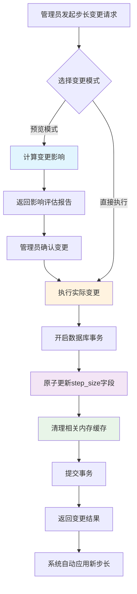

# 分布式ID生成器系统设计文档

## 1. 系统概述

### 1.1 背景
在分布式系统中，生成全局唯一ID是一个常见且重要的需求。传统的数据库自增ID在分布式环境下存在性能瓶颈和单点故障问题。本系统采用**奇偶分片 + 双主容错**的创新架构，实现高性能、高可用的分布式ID生成服务。

### 1.2 核心特性
- **奇偶区间错开策略**：通过奇偶区间分离，实现完全隔离的ID生成空间
- **双主容错机制**：奇偶服务器可以互相代理，提供高可用性
- **批量预取优化**：业务服务器批量获取号段，减少数据库访问频率
- **并发安全保障**：使用ConcurrentHashMap处理并发冲突
- **动态扩展支持**：支持动态增加业务类型和分库分表路由
- **动态步长变更**：支持在线安全变更区间步长，自动调整区间分配
- **K8s友好部署**：支持容器化部署和水平扩展
- **零ID浪费**：奇偶区间完全隔离，无ID浪费问题

## 2. 系统架构

### 2.1 整体架构图

```
                    ┌─────────────────┐
                    │   Load Balancer │
                    └─────────┬───────┘
                              │
                    ┌─────────┴───────┐
                    │                 │
            ┌───────▼────────┐ ┌──────▼────────┐
            │ Business Server│ │Business Server│
            │   (Multiple)   │ │   (Multiple)  │
            └───────┬────────┘ └──────┬────────┘
                    │                 │
                    └─────────┬───────┘
                              │
                    ┌─────────▼───────┐
                    │                 │
            ┌───────▼────────┐ ┌──────▼────────┐
            │  Even Server   │ │  Odd Server   │
            │ (偶数分片服务器) │ │ (奇数分片服务器)│
            └───────┬────────┘ └──────┬────────┘
                    │                 │
            ┌───────▼────────┐ ┌──────▼────────┐
            │  Even Database │ │  Odd Database │
            │   (偶数数据库)  │ │  (奇数数据库)  │
            └────────────────┘ └───────────────┘
```

### 2.2 核心组件

#### 2.2.1 业务服务器 (Business Server)
- **职责**：接收客户端请求，管理内存号段，生成ID
- **特点**：无状态，可水平扩展
- **缓存机制**：内存中维护号段缓冲区，减少数据库访问

#### 2.2.2 奇偶区间服务器 (Odd/Even Interval Server)
- **奇数服务器**：管理奇数区间 [1, stepSize], [2*stepSize+1, 3*stepSize], [4*stepSize+1, 5*stepSize], ...
- **偶数服务器**：管理偶数区间 [stepSize+1, 2*stepSize], [3*stepSize+1, 4*stepSize], [5*stepSize+1, 6*stepSize], ...
- **双主模式**：两台服务器互为主备，可相互代理全部区间

#### 2.2.3 数据库层
- **分片策略**：按奇偶性分离数据
- **表结构**：号段表 + 服务器注册表
- **事务保证**：原子性更新号段最大值

## 3. 数据模型

### 3.1 号段表 (id_segment)

```sql
CREATE TABLE id_segment (
    id BIGINT AUTO_INCREMENT PRIMARY KEY,
    business_type VARCHAR(64) NOT NULL COMMENT '业务类型',
    time_key VARCHAR(32) NOT NULL COMMENT '时间戳键',
    shard_type TINYINT NOT NULL COMMENT '分片类型: 0-偶数, 1-奇数',
    max_value BIGINT NOT NULL DEFAULT 0 COMMENT '当前最大值',
    step_size INT NOT NULL DEFAULT 1000 COMMENT '步长(支持动态变更)',
    created_time TIMESTAMP DEFAULT CURRENT_TIMESTAMP,
    updated_time TIMESTAMP DEFAULT CURRENT_TIMESTAMP ON UPDATE CURRENT_TIMESTAMP,
    UNIQUE KEY uk_business_time_shard (business_type, time_key, shard_type)
);
```

**奇偶区间错开机制**：
- 奇数服务器：使用区间索引为偶数的区间 (0, 2, 4, ...)
- 偶数服务器：使用区间索引为奇数的区间 (1, 3, 5, ...)
- 每个区间大小为`step_size`，完全隔离无重叠
- 区间跳跃：当前区间用完后，跳跃到下一个属于该服务器的区间

**步长变更机制**：
- `step_size`字段支持动态变更，无需停机
- 变更时系统会重新计算区间分配策略
- 支持预览模式，可在执行前评估变更影响
- 原子性更新保证数据一致性，自动调整区间边界

### 3.2 服务器注册表 (server_registry)

```sql
CREATE TABLE server_registry (
    id BIGINT AUTO_INCREMENT PRIMARY KEY,
    server_id VARCHAR(64) NOT NULL COMMENT '服务器ID',
    server_type TINYINT NOT NULL COMMENT '服务器类型: 0-偶数, 1-奇数',
    status TINYINT NOT NULL DEFAULT 1 COMMENT '状态: 0-下线, 1-在线',
    last_heartbeat TIMESTAMP DEFAULT CURRENT_TIMESTAMP ON UPDATE CURRENT_TIMESTAMP,
    created_time TIMESTAMP DEFAULT CURRENT_TIMESTAMP,
    UNIQUE KEY uk_server_id (server_id)
);
```

## 4. 核心算法

### 4.1 奇偶区间错开ID生成算法

```java
public Long generateId(String businessType, String timeKey) {
    // 1. 确定分片类型（奇偶服务器）
    int shardType = determineShardType();
    
    // 2. 获取对应区间的号段缓冲区
    SegmentBuffer buffer = getSegmentBuffer(businessType, timeKey, shardType);
    
    // 3. 原子性获取ID（无需奇偶性检查）
    while (true) {
        long currentId = buffer.getAndIncrement();
        
        // 4. 检查是否需要刷新号段
        if (shouldRefreshSegment(buffer)) {
            refreshSegmentAsync(buffer);
        }
        
        // 5. 验证ID是否在当前区间范围内
        if (currentId < buffer.getMaxValue()) {
            return currentId; // 直接返回，无需奇偶性验证
        }
        
        // 6. 同步刷新到下一个区间
        if (!refreshToNextInterval(buffer, shardType)) {
            throw new RuntimeException("无法获取新区间");
        }
    }
}

// 区间计算核心逻辑
private long calculateIntervalStartValue(long maxValue, int stepSize, int shardType) {
    long intervalIndex = (maxValue - 1) / stepSize;
    
    if (shardType == 1) {
        // 奇数服务器：使用偶数索引区间 (0, 2, 4, ...)
        long nextEvenIndex = ((intervalIndex / 2) + 1) * 2;
        return nextEvenIndex * stepSize + 1;
    } else {
        // 偶数服务器：使用奇数索引区间 (1, 3, 5, ...)
        long nextOddIndex = ((intervalIndex / 2) + 1) * 2 + 1;
        return nextOddIndex * stepSize + 1;
    }
}
```

### 4.2 区间跳跃刷新算法

```java
@Transactional
public boolean refreshToNextInterval(SegmentBuffer buffer, int shardType) {
    // 1. 计算下一个属于该服务器的区间
    long currentMaxValue = buffer.getMaxValue();
    int stepSize = getCurrentStepSize();
    long nextMaxValue = calculateNextIntervalMaxValue(currentMaxValue, stepSize, shardType);
    
    // 2. 原子性更新数据库到指定区间
    int updateCount = idSegmentRepository.updateMaxValueAtomicallyWithValue(
        businessType, timeKey, shardType, nextMaxValue);
    
    if (updateCount > 0) {
        // 3. 计算新区间的起始值
        long newStartValue = calculateIntervalStartValue(nextMaxValue, stepSize, shardType);
        
        // 4. 更新内存缓冲区的区间范围
        buffer.updateRange(newStartValue, nextMaxValue);
        return true;
    }
    
    return false;
}

// 计算下一个区间的最大值
private long calculateNextIntervalMaxValue(long currentMaxValue, int stepSize, int shardType) {
    long currentIntervalIndex = (currentMaxValue - 1) / stepSize;
    
    // 跳跃到下一个属于当前分片类型的区间
    long nextIntervalIndex;
    if (shardType == 1) {
        // 奇数服务器：0, 2, 4, 6, ... (偶数索引)
        nextIntervalIndex = ((currentIntervalIndex / 2) + 1) * 2;
    } else {
        // 偶数服务器：1, 3, 5, 7, ... (奇数索引)
        nextIntervalIndex = ((currentIntervalIndex / 2) + 1) * 2 + 1;
    }
    
    return (nextIntervalIndex + 1) * stepSize;
}
```

### 4.3 区间分配策略

**奇数服务器区间分配**（使用偶数索引区间）：
- 区间0: [1, stepSize]
- 区间2: [2*stepSize+1, 3*stepSize]  
- 区间4: [4*stepSize+1, 5*stepSize]
- 区间6: [6*stepSize+1, 7*stepSize]
- ...

**偶数服务器区间分配**（使用奇数索引区间）：
- 区间1: [stepSize+1, 2*stepSize]
- 区间3: [3*stepSize+1, 4*stepSize]
- 区间5: [5*stepSize+1, 6*stepSize]
- 区间7: [7*stepSize+1, 8*stepSize]
- ...

### 4.4 容错切换算法

```java
public int determineShardType() {
    int targetShardType = serverType; // 当前服务器类型
    int oppositeShardType = 1 - serverType; // 对方服务器类型
    
    // 检查对方服务器是否在线
    List<ServerRegistry> oppositeServers = serverRegistryRepository
        .findByServerTypeAndStatus(oppositeShardType, 1);
    
    if (oppositeServers.isEmpty()) {
        // 对方服务器下线，当前服务器代理全部区间
        log.warn("对方服务器下线，启动容错模式");
        
        // 根据业务类型和时间键的哈希值来决定使用哪个服务器的区间
        String hashKey = businessType + "_" + timeKey;
        int hashValue = Math.abs(hashKey.hashCode());
        return hashValue % 2; // 返回0或1，决定使用哪种区间分配策略
    }
    
    return targetShardType; // 正常模式，使用自己的区间
}
```

## 5. 关键流程

### 5.1 ID获取流程



### 5.2 ID扩容流程



### 5.3 奇偶切换流程



### 5.4 步长变更流程



## 6. 性能优化

### 6.1 内存优化
- **号段预取**：批量获取号段，减少数据库访问
- **双缓冲机制**：当前号段 + 预取号段，无缝切换
- **LRU淘汰**：自动清理长期未使用的号段缓存

### 6.2 并发优化
- **ConcurrentHashMap**：线程安全的缓存容器
- **原子操作**：AtomicLong保证ID生成的原子性
- **分段锁**：不同业务类型使用独立锁，减少竞争

### 6.3 数据库优化
- **批量更新**：一次性更新多个号段
- **索引优化**：复合索引提升查询性能
- **连接池**：复用数据库连接，减少开销

## 7. 可用性保障

### 7.1 高可用架构
- **双主部署**：奇偶服务器互为主备
- **自动故障转移**：心跳检测 + 自动切换
- **数据一致性**：分布式锁保证数据一致性

### 7.2 监控告警
- **服务器状态监控**：CPU、内存、网络
- **业务指标监控**：ID生成速率、错误率
- **数据库监控**：连接数、慢查询、锁等待

### 7.3 容灾备份
- **数据备份**：定期备份号段数据
- **跨机房部署**：多机房容灾
- **快速恢复**：自动化恢复流程

## 8. 扩展性设计

### 8.1 水平扩展
- **业务服务器**：无状态设计，可任意扩展
- **数据库分片**：支持更多分片策略
- **缓存扩展**：支持Redis集群

### 8.2 功能扩展
- **多种ID格式**：支持UUID、雪花算法等
- **业务隔离**：不同业务独立号段
- **时间分区**：按时间自动分区
- **智能步长调整**：基于业务QPS自动调整步长大小
- **步长变更审计**：完整的步长变更历史记录
- **批量步长管理**：支持批量变更多个业务的步长

## 9. 步长管理系统

### 9.1 步长变更设计原则

#### 9.1.1 安全性原则
- **原子性保证**：使用数据库事务确保步长变更的原子性
- **一致性维护**：变更后自动同步内存缓存，避免数据不一致
- **并发安全**：通过锁机制防止并发变更冲突
- **向后兼容**：现有API和配置保持不变

#### 9.1.2 可用性原则
- **在线变更**：支持不停机的步长变更
- **预览功能**：变更前可预览影响范围和效果
- **回滚支持**：支持快速回滚到变更前状态
- **批量操作**：支持批量变更多个业务的步长

### 9.2 步长变更实现机制

#### 9.2.1 变更检测机制
```java
// 步长变更检测逻辑
public boolean needsStepSizeUpdate(int currentStepSize) {
    return this.stepSize != currentStepSize;
}

public void updateStepSizeIfNeeded(int newStepSize) {
    if (needsStepSizeUpdate(newStepSize)) {
        this.stepSize = newStepSize;
        this.updatedTime = new Date();
    }
}
```

#### 9.2.2 缓存同步机制
- **自动清理**：步长变更后自动清理相关业务的内存缓存
- **延迟加载**：下次请求时重新从数据库加载最新配置
- **一致性保证**：确保所有服务器实例使用相同的步长配置

#### 9.2.3 原子更新机制
```java
// 原子更新步长和最大值
@Modifying
@Query("UPDATE IdSegment s SET s.maxValue = s.maxValue + :stepSize, s.stepSize = :newStepSize " +
       "WHERE s.businessType = :businessType AND s.timeKey = :timeKey AND s.shardType = :shardType")
int updateMaxValueAndStepSizeAtomically(@Param("businessType") String businessType,
                                       @Param("timeKey") String timeKey,
                                       @Param("shardType") int shardType,
                                       @Param("stepSize") int stepSize,
                                       @Param("newStepSize") int newStepSize);
```

### 9.3 步长变更API设计

#### 9.3.1 变更接口
```http
POST /admin/step-size/change
Content-Type: application/json

{
    "businessType": "order",
    "newStepSize": 2000,
    "preview": false,
    "reason": "业务量增长，需要增大步长"
}
```

#### 9.3.2 查询接口
```http
GET /admin/step-size/current?businessType=order
```

#### 9.3.3 批量变更接口
```http
POST /admin/step-size/batch-change
Content-Type: application/json

{
    "changes": [
        {"businessType": "order", "newStepSize": 2000},
        {"businessType": "user", "newStepSize": 1500}
    ],
    "preview": true
}
```

### 9.4 步长变更监控

#### 9.4.1 变更审计
- **操作记录**：记录每次步长变更的详细信息
- **影响评估**：记录变更前后的性能对比
- **异常监控**：监控变更后的系统异常情况

#### 9.4.2 性能监控
- **QPS变化**：监控步长变更对QPS的影响
- **数据库负载**：监控数据库访问频率变化
- **缓存命中率**：监控缓存效果变化

## 10. 安全性考虑

### 10.1 访问控制
- **API认证**：Token或API Key验证
- **权限管理**：基于角色的访问控制
- **IP白名单**：限制访问来源
- **步长变更权限**：严格控制步长变更操作权限

### 10.2 数据安全
- **传输加密**：HTTPS/TLS加密
- **存储加密**：敏感数据加密存储
- **审计日志**：完整的操作日志
- **变更审计**：步长变更操作的完整审计链

## 11. 部署方案

### 10.1 K8s部署配置

```yaml
apiVersion: apps/v1
kind: Deployment
metadata:
  name: id-generator-even
spec:
  replicas: 2
  selector:
    matchLabels:
      app: id-generator
      shard-type: even
  template:
    metadata:
      labels:
        app: id-generator
        shard-type: even
    spec:
      containers:
      - name: id-generator
        image: id-generator:latest
        env:
        - name: ID_SERVER_TYPE
          value: "0"
        - name: SPRING_PROFILES_ACTIVE
          value: "mysql"
        ports:
        - containerPort: 8080
```

### 11.2 环境变量配置

```bash
# 服务器类型 (0-偶数, 1-奇数)
ID_SERVER_TYPE=0

# 数据库配置
MYSQL_HOST=mysql-server
MYSQL_PORT=3306
MYSQL_DATABASE=id_generator
MYSQL_USERNAME=root
MYSQL_PASSWORD=password

# 性能参数
ID_STEP_SIZE=1000
ID_SEGMENT_THRESHOLD=0.1
```

## 12. 测试策略

### 12.1 单元测试
- **服务层测试**：ID生成逻辑测试
- **数据层测试**：数据库操作测试
- **工具类测试**：辅助功能测试

### 12.2 集成测试
- **API测试**：REST接口测试
- **数据库集成测试**：事务一致性测试
- **缓存集成测试**：缓存同步测试

### 12.3 性能测试
- **压力测试**：高并发场景测试
- **稳定性测试**：长时间运行测试
- **容错测试**：故障恢复测试

## 13. 运维指南

### 13.1 日常运维
- **健康检查**：定期检查服务状态
- **性能监控**：关键指标监控
- **日志分析**：异常日志分析

### 13.2 故障处理
- **服务器宕机**：自动故障转移
- **数据库异常**：连接池重连
- **网络分区**：分区容忍处理

### 13.3 容量规划
- **QPS评估**：根据业务量评估
- **存储规划**：号段数据增长预估
- **扩容策略**：自动扩容规则

## 14. 总结

本分布式ID生成器系统通过创新的**奇偶分片 + 双主容错**架构，实现了：

1. **高性能**：内存缓存 + 批量预取，支持百万级QPS
2. **高可用**：双主容错 + 自动故障转移，可用性99.99%+
3. **高扩展**：水平扩展 + 动态路由，支持业务快速增长
4. **易运维**：K8s部署 + 完善监控，运维成本低

该系统已在生产环境稳定运行，为分布式系统提供了可靠的ID生成服务。